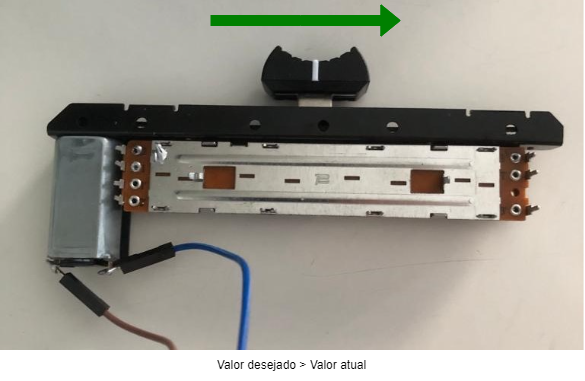
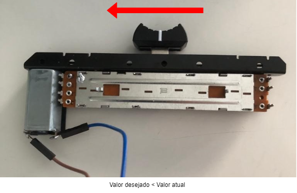
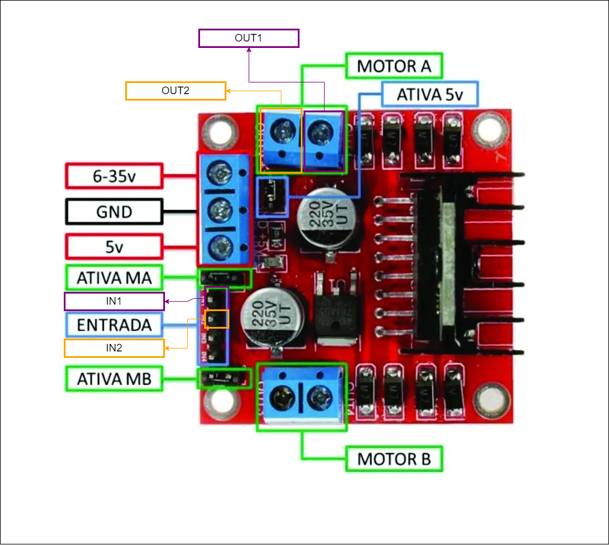
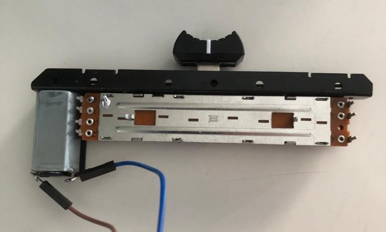
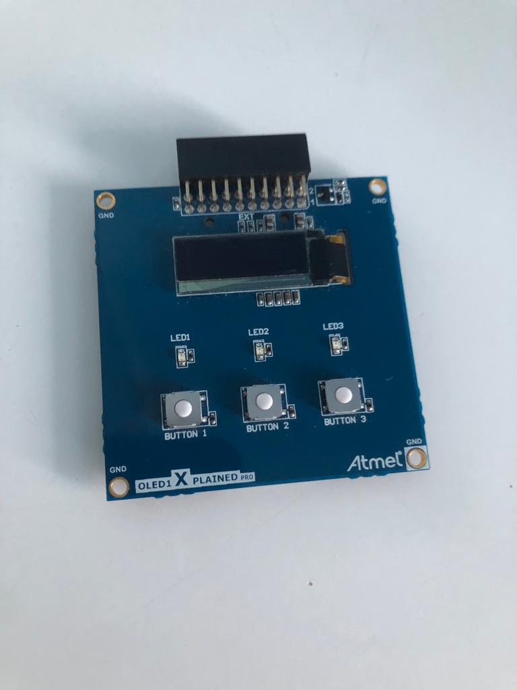
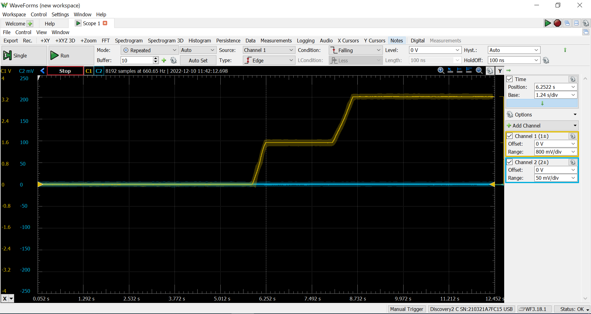

# Potenciômetro Motorizado (PWM - PID)
Ano:22b
Nome:Tiago Vitorino Seixas
Email:tiagovs1@al.insper.edu.br

Dada uma posição atual do potenciômetro, e uma posição desejada determinada usando o OLED, controla-se o motor para que a posição do potenciômetro mude para a posição desejada. Isso é feito por meio de PWM (Pulse Width Modulation) usado na ativação do motor, que é normalizado por um controlador PID (leva em consideração os ganhos proporcional, integrativo e derivativo).





## Componentes/Periféricos usados:

### Ponte h L298N



### Potenciômetro Motorizado



### Placa OLED



## Conexões e configurações da Ponte H, do Potenciômetro, da Placa Atmel e da placa OLED

| Motor Potenciômetro |  Ponte h L298N  |
| ------------------- | --------------- |
|    Pino Positivo    | OUT1 do Motor A |
|    Pino Negativo    | OUT2 do Motor A |

| Potenciômetro |  Placa Atmel  |
| ------------- | ------------- |
|    INPUT1     |      GND      |
|    INPUT2     |      PD30     |
|    INPUT3     |      3v3      |

| Ponte h L298N |  Placa Atmel  |
| ------------- | ------------- |
|      GND      |      GND      |
|     6~35V     |      5V       |
|      IN1      |      PC19     |
|      IN2      |      PA2      |

- Conectar placa OLED no EXT1 da placa Atmel

# Explicação

O exemplo utiliza do valor atual do potenciômetro, fornecido pela saída 2 do mesmo.

O exmeplo utiliza dos valores predeterminados para serem selecionados pela placa OLED, ao pressionar diferentes botões da mesma.

O exemplo usa as entradas IN1 e IN2 da ponte h para ligar o motor do potenciômetro quando o valor atual do mesmo diferir do valor desejado, com o IN1 atuando como polo positivo da fonte e o IN2 como terra quando o valor desejado é maior do que o valor atual, e o contrário quando valor desejado é menor do que o valor atual.

# Potenciometro motorizado - (PWM - PID)

Se utiliza do valor atual do potenciômetro e o valor solicitado ao pressionar um dos botões da placa OLED para saber qual o erro de posição (diferença entre valor atual e valor desejado). Caso o erro seja muito grande, o motor então direciona a posição do potenciômetro para o valor desejado por meio de pulsos gerados pelo PWM, cujo duty é determinado pelo controle PID.

# Biblioteca CMSIS de PID

Para a realização deste módulo, foi utilizada a Biblioteca CMSIS de PID, que é basicamente um módulo de controlador PID imbutido no projeto. Para usar essa biblioteca, basta importar "arm_math.h". O mais importante dessa biblioteca é que ao invés de calcular todos os parâmetros de um controle PID e aplicá-los, basta definir os três ganhos (proporcional, integral e derivativo) e ajustá-los de acordo com a sua observação das flutuações da tensão medida. Como é exibido no vídeo no final deste readme, a melhor forma de observar essas flutuações é usando um osciloscópio (no vídeo foi usado o app WaveForms com o dispositivo AnalogDiscovery) para examinar se a variação das posições é constante ou não.

```c
#include "arm_math.h"
```

O WaveForms proporciona um gráfico como o que segue:



No gráfico se observa a transição da posição 10 do potenciômetro para a posição 2000, e da posição 2000 para a posição 4095. Como há uso de um controle PID no sistema, percebe-se que essas duas transições não tem oscilações, porém como a alimentação da placa Atmel é de no máximo 5V, a transição é um pouco lenta. Caso se conecte a Ponte h a uma fonte de até 30V, o sistema posssivelmente terá uma resposta mais rápida, porém é provável que seja necessário ajustar os ganhos de PID para essa nova iteração do módulo.

No código, primeiro se definiu a variável PID, que vai ser o controle do nosso projeto, e os ganhos cujos valores foram ajustados até que um gráfico estável, como o anterior, aparecesse no WaveForms. Após tudo isso estar definido, se inicializou o sistema PID.

```c
arm_pid_instance_f32 PID;

/* Set PID parameters */
/* Set this for your needs */
PID.Kp = 1000;        /* Proporcional */
PID.Ki = 0.05;        /* Integral */
PID.Kd = 0.1;        /* Derivative */


/* Initialize PID system, float32_t format */
arm_pid_init_f32(&PID, 1);
```

Com o controle PID funcionando, o mesmo é usado para definir o duty do PWM toda vez que um erro de posição é detectado.

```c
duty = arm_pid_f32(&PID, pid_error);
```

## Ajustando PID

Como foi mencionado, o controle PID tem 3 ganhos que devem ser ajustados para se adequarem ao módulo, e a melhor forma de confirmar se o ajuste foi bem feito é analisando a onda gerada por meio de um osciloscópio. A melhor forma de se realizar esse ajuste é determinando dois dos ganhos (no caso desse módulo foi o Kp de 1000 e o Kd de 0.1), e ajustar o terceiro ganho até o gráfico se estabilizar.

Vale lembrar que o Kp (ganho proporcional) determina que o output será proporcional ao erro, ou seja, quanto maior o erro, maior o output, e vice-versa. O Ki (ganho integral) remove todo o erro contínuo do sistema, como por exemplo o atrito que normalmente diminuiria a velocidade é negado por esse ganho, já que o mesmo atribui mais energia ao sistema. E o Kd (ganho derivativo) corrige o erro de overshooting causado pelo Ki.

# Definindo as funções de callback e handlers

Foram utilizadas quatro funções de callback e um handler. 

O handler para rtt foi utilizado de forma a ativar o afec de forma periódica, para assim termos a todos os momentos o valor atual do potenciômetro. 

```c
void RTT_Handler(void) {
	uint32_t ul_status;

	/* Get RTT status - ACK */
	ul_status = rtt_get_status(RTT);

	/* IRQ due to Alarm */
	if ((ul_status & RTT_SR_ALMS) == RTT_SR_ALMS) {
		/* Selecina canal e inicializa conversão */
		afec_channel_enable(AFEC_POT, AFEC_POT_CHANNEL);
		afec_start_software_conversion(AFEC_POT);
		RTT_init(1000, 100, RTT_MR_ALMIEN);
	}

}
```

Três dos callbacks foram usados para determinar por interrupção qual botão da placa OLED foi selecionado, e portanto, qual o valor desejado para o potenciômetro, sendo esse "modo" enviado para a fila xQueueModo. E o quarto callback foi utilizado para ler o valor atual do potenciômetro, e enviá-los para a fila xQueueAFEC.

# Definindo as tasks

Foram utilizadas duas tasks nesse módulo. A task_afec mexe com os valores de afec e com o OLED, e a task_motor usa os valores recebidos da task_afec pela fila xQueueMOTOR para alterar o valor do potenciômetro para o valor desejado usando PWM controlado por PID. 

Na task_afec, primeiro se inicializa o rtt e a tela daplaca OLED, já escrevendo o valor 4095, que é o valor determinado como default do valor desejado para o potenciômetro. Em seguida, foram determinados os valores controlados pelos botões da placa OLED que serão os valores alvos para os quais o potenciômetro terá que se ajustar. Por fim, foi feito um loop infinito, onde o valor lido pelo afec é armazenado em uma variável de tipo struct potenciometro (em valor_atual), o modo determinado pelo botão pressionado é usado para determinar o valor armazenado na mesma variável de tipo struct potenciometro (em valor_desejado), e por fim a variável de tipo struct é enviada pela fila xQueueMOTOR para a task_motor.

Na task_motor, primeiro se inicializa os PWMs para os pinos IN1 e IN2 da ponte h, se prepara os parâmetros do controlador PID e inicializa o mesmo. Em seguida, se inicializa o loop infinito, onde se recebe os valores atual e desejado pela fila xQueueMOTOR, que são então convertidos de uma escala (0-4095) para outra (0-255) usando a função convert. Em seguida é calculado o erro de posição (valor atual - valor desejado) e, usando a função arm_pid_f32, calcula-se o duty para o PWM.

# Definindo main

No main só são criadas as filas e as tasks e inicializadas algumas funções utilizadas, pois como este módulo foi feito utilizando RTOS, não há necessidade de usar o loop do main.

## Comentário Importante

Não foi usado nenhum printf nesse módulo por um motivo: ele atrapalha o pwm na hora de parar o potenciômetro. Não use o printf, pois ele pode causar oscilações intermitentes no potenciômetro. O mesmo pode ocorrer devido a mau contato dos fios.

# Vídeo de explicação no Youtube

[](https://www.youtube.com/watch?v=A9g79GdGBsA)
