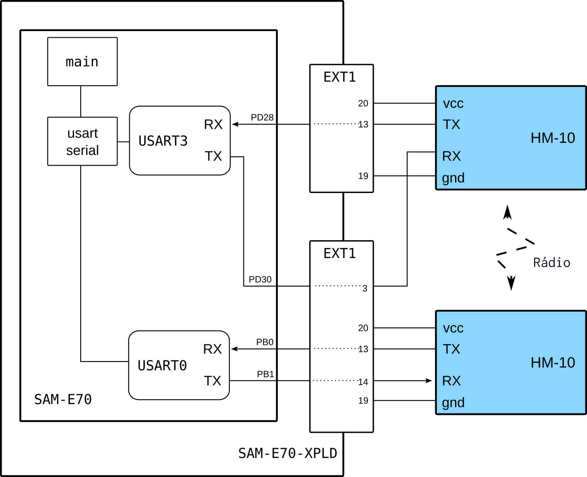

# BlueTooth HM-10

Esse exemplo demonstra o uso do módulo BlueTooth HM-10 para a comunicação entre dois módulos bluetooth
no modo *ponto-a-ponto*.

- Módulos: 
    - 2x BlueeTooth HM-10 (ou HC-05)

- Periféricos:
    - Power Managment Controller (PMC)
    - Universal Synchronous Asynchronous Receiver Transceiver (USART)
        - USART0 (comunicação com o HM-10)
        - USART3 (comunicação com o HM-10)
        - USART1 / DEBUG (comunicação com o PC - `stdio`)
   
- Pinos:
    - a: BlueeTooth HM-10 
        - `PB0`: UART0 TX 
        - `PB1`: UART0 RX
    - b: BlueeTooth HM-10 
        - `PD30`: UART3 TX 
        - `PD28`: UART3 RX
    - `stdio` / DEBUG
        - `PB4`:  UART1 
        - `PD21`: UART1

## Conexão e configuração

| Módulo         | SAME70-XPLD       | SAME70 (uC) | SAME70           |
|----------------|-------------------|-------------|------------------|
| (a) HC10 - VCC | EXT1 - PIN 20     | VCC         | -                |
| (a) HC10 - GND | EXT1 - PIN 19     | GND         | -                |
| (a) HC10 - TXD | EXT1 - PIN 13     | PB0         | RXD0   (USART 0) |
| (a) HC10 - RXD | EXT1 - PIN 14     | PB1         | TXD0   (USART 0) |
|                |                   |             |                  |
| (b) HC10 - VCC | EXT2 - PIN 20     | VCC         | -                |
| (b) HC10 - GND | EXT2 - PIN 19     | GND         | -                |
| (b) HC10 - TXD | EXT2 - PIN 13     | PD28        | RXD0             |
| (b) HC10 - RXD | EXT**1** - PIN 3  | PD30        | TXD0             |

## Diagrama

