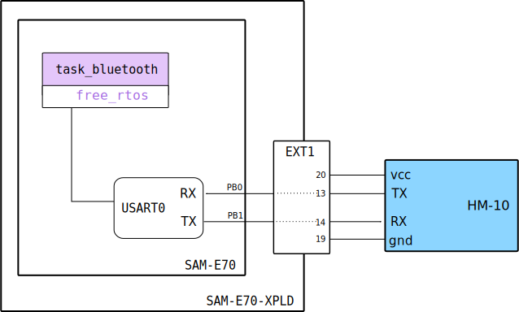

# BlueTooth HM-10 e HC-06

Esse exemplo demonstra o uso do módulo BlueTooth HM-10/HC-06 em modo *Slave* com um RTOS

:exclamation: Seguir conexão igual ao do exemplo: [Bluetooth-HM10](https://github.com/Insper/SAME70-examples/tree/master/Comunicacao/Bluetooth-HM10)

## Diagrama



## firmware

Nesse exemplo, criamos uma tarefa no RTOS que é responsável por inicializar o módulo bluetooth (usando as mesmas funções dos outros exemplos), e ficar enviando a cada 500ms um string (`oi do bluetooth`) para o bluetooth.

A task possui a seguinte implementação:

```c
/************************************************************************/
/* TASKS                                                                */
/************************************************************************/

void task_bluetooth(void){

  printf("Bluetooth initializing \n");
  hc06_config_server();
  hc06_server_init();
  io_init();
  printf("done\n");

  while(1){
    usart_put_string(USART0, "oi do bluetooth\n");
    vTaskDelay( 500 / portTICK_PERIOD_MS);
  }
}
```
