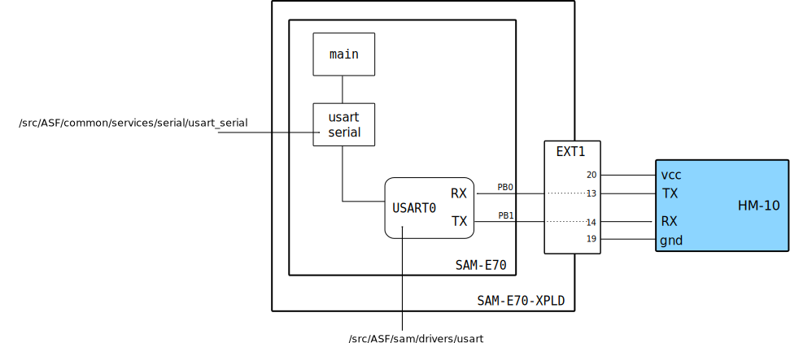
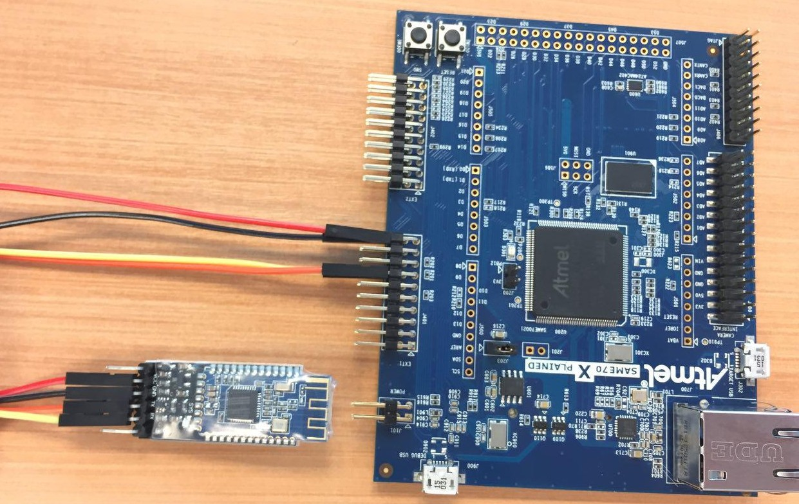
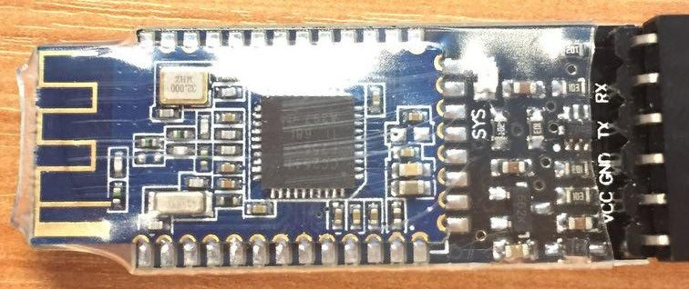

# BlueTooth HM-10 e HC-06

Esse exemplo demonstra o uso do módulo BlueTooth HM-10 em modo *Slave* 

- Módulos: 
    - BlueeTooth HM-10 (ou HC-06)

- Periféricos:
    - Power Managment Controller (PMC)
    - Universal Synchronous Asynchronous Receiver Transceiver (USART)
        - USART0 (comunicação com o HM-10)
        - USART1 / DEBUG (comunicação com o PC - `stdio`)
   
- Pinos:
    - BlueeTooth HM-10
        - `PB0`: UART0 TX 
        - `PB1`: UART0 RX
    - `stdio` / DEBUG
        - `PB4`:  UART1 
        - `PD21`: UART1

## Diagrama

## Conexão e configuração

No exemplo, devemos conectar o módulo HM-10 ao kit de desenvolvimento via o conector EXT-1 
(devido ao modulo UART escolhido). 

A conexão deve ser a seguinte :

| HM-10 | EXT1 (SAME70-XPLD) | SAME70 (uC) | SAME70 (USART) |
|-------|--------------------|-------------|----------------|
| VCC   | PIN 20             | VCC         | -              |
| GND   | PIN 19             | GND         | -              |
| TXD   | PIN 13             | PB0         | RXD0 (USART 0) |
| RXD   | PIN 14             | PB1         | TXD0 (USART 0) |

## HM-10

O HM-10 é um módulo de comunicação BlueTooth bastante difundido no mundo maker por possuir um baixo custo e 
ser de uso simples. 
Maiores detalhes : [HM-10 Tutorial](http://fab.cba.mit.edu/classes/863.15/doc/tutorials/programming/bluetooth.html).

O HM-10 pode operar em diversos modos de operação, o modo padrão que vem de fábrica é o dispositivo sendo 
o *Slave*, ou seja,ele a conexão de um outro dispositivo (como uma caixa de som bluetooth**.
Uma vez um dispositivo conectado a ele, ele opera de modo transparente, onde todos os dados que chegam 
até via blueetooth ele são automaticamente encaminhados para o microcontrolador e todos os dados que chegam
do microcontrolador são automaticamente encaminhados para o bluetooth. O dispositivo possui o seguinte nome padrão:

> **HMSof**

### Módo de configuração

Sempre que o HM-10 não estiver conectado a nenhum dispositivo ele irá começar a interpretar as mensagens 
que são envidas do microcontrolador para o HM-10 como mensagens de configuração, essa mensagens seguem
o padrão chamado de [AT](https://en.wikipedia.org/wiki/Hayes_command_set).

Dessa maneira é possível alterarmos uma série de configurações listadas no datasheet do módulo, essas
configurações podem ser por exemplo o nome do dispositivo blueetooth, sua forma de operação 
(alterando para ser o dispositivo que conecta a um slave), senhas, dentre outras.

### Comunicação

O HM-10 utiliza como interface de comunicação com o microcontrolador o protocolo assíncrono : 
Universal asynchronous receiver/transmitter [UART](https://learn.sparkfun.com/tutorials/serial-communication/uarts).

### Explicação 

Uma vez definido o protocolo de comunicação do módulo a ser interfaceado (UART) devemos procurar no
microcontrolador os pinos que podem ser controlados pelo periférico interno que codifica e decodifica
o protocolo em questão.

É necessário analisarmos simultaneamente o manual do microcontrolador para identificarmos:

1. O periférico capaz de se comunicar com esse protocolo
1. Os pinos que podem ser controlados por esse periférico
1. Os que estão disponíveis no kit de desenvolvimento/ placa.
