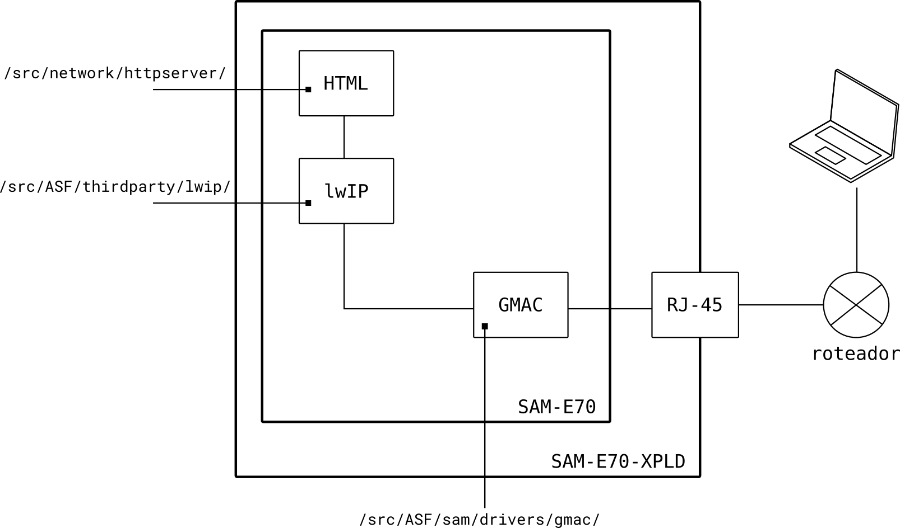
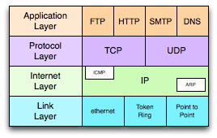

# Ethernet lwIP HTTP

- Módulos: 
    - (usa a Ethernet do kit)
    
- Periféricos:
    - GMAC (Ethernet MAC)
    - TimerConter 0 (TC0)
    - USART1 / DEBUG (comunicação com o PC - `stdio`)
   
- Pinos:
    - GMAC
        - `PD8`: PHY_MDC
        - `PD9`: PHY_MDIO
        - `PD0`: PHY_REFCLK
        - `PC10`: PHY_RESET
        - `PA14`: PHY_INTERRUPT
        - `PD2`: PHY_TXD0
        - `PD3`: PHY_TXD1
        - `PD5`: PHY_RXD0
        - `PD6`: PHY_TXD1
        - `PD7`: PHY_RXEN
        - `PD4`: PHY_CRS_DV
    - `stdio` / DEBUG
        - `PB4`:  UART1 
        - `PD21`: UART1
 
- APIs:
    - A Lightweight TCP/IP stack (lwIP)
 
## Diagrama



 
## Explicação

Esse exemplo demonstra a conexão Ethernet (cabeada) do kit de desenvolvimento SAME-70, criando um servidor web no microcontrolador onde um segundo dispositivo pode acessar a página.


### USART

- BaudRate : 115200
- StopBit  : 1 bit
- Paridade : 0 bit
- Data     : 8 bits

Utilizado como debug do programa, deve-se utilizar um terminal (exe. putty) no computador para acessar o printf realizado no firmware.
 
### Ethernet MAC (GMAC)

Periférico do uC que implementa uma comunicação 10/100 Mbps Ethernet Mac compatível com padrão IEEE 802.3 (ethernet) podendo
operar de forma half ou full-duplex.

O GMAC implementa a camada de **Link** do modelo de camadas da internet, as demais camadas são de responsabilidade do firmware (lwIP).



[1] http://network-development.blogspot.com.br/2014/02/layers-of-internet-protocol-suite.html

### lwIP

O [lwIP](https://savannah.nongnu.org/projects/lwip/) é um framework escrito em C focado em embarcados, ele é responsável por implementar e gerenciar as demais camadas do modelo da internet, o lwIP é modular e a lista de módulos é configurada em:

`/src/config/lwipopts.h`

### TimerCounter 0 

O TimerCounter é utilizado em modo astável para incrementar uma variável global usada como tick do sistema, é implementado em :

`/src/network/timer_mgt.c`

``` c
/**
 * TC0 Interrupt handler.
 */
void TC0_Handler(void)
{
	/* Remove warnings. */
	volatile uint32_t ul_dummy;

	/* Clear status bit to acknowledge interrupt. */
	ul_dummy = TC0->TC_CHANNEL[0].TC_SR; 

	/* Increase tick. */
	gs_ul_clk_tick++;
}
```

## Executando

1. conecte o kit de desenvolvimento em um roteador via cabo de rede
2. programe o microcontrolador com o código
3. abra a interface serial (COM) para receber dados de debug
4. espere o lwIP buscar um IP no roteador (DHCP) o IP irá aparecer no terminal
5. conecte o computador no mesmo roteador que o kit
6. abra o navegador e acesse o IP do kit (http://IP)


## Modificando

Para modificar a página da web basta inserir o arquivo .html em uma constante (/src/network/httpserver/fsdata.c) depois criar
uma lista ligada que conecta todos os aquivos desse servidor via a declaração de uma estrutura ( final do fsdata.c)

Exemplo:

``` c
unsigned char data_insper_html[] = "<!DOCTYPE html> <html> <body>  <h1>Insper: Computacao Embarcada</h1> <p>Teste httpd com lwIP no SAME70</p> <p> Acesso numero: XXXXXXX </p> </body> </html>";
```

Depois é necessário criar a estrutura para cada arquivo do tipo `fsdata_file`:

```C
struct fsdata_file {
  const struct fsdata_file *next;
  const unsigned char *name;
  const unsigned char *data;
  const int len;
};
```

Essa estrutura tem 4 conteúdos:

- `*next` : um ponteiro para a próxima estrutura
- `*name` : o caminho desse arquivo, exemplo "/img/logo.png"
- `*data` : o endereço do arquivo criado anteriormente 
- `len`   : o tamanho do arquivo

O exemplo a seguir ilustra 5 arquivos com a estrutura a seguir:

``` 
/ 
 index.html
 404.html
 insper.html
 img/
   logo.png
   sics.gif
```

```C
const struct fsdata_file file_img_logo_png[] = {{NULL, "/img/logo.png", data_img_logo_png + 14, sizeof(data_img_logo_png) -14}};
const struct fsdata_file file_insper_html[] = {{file_img_logo_png, "/insper.html", data_insper_html, sizeof(data_insper_html)}};
const struct fsdata_file file_img_sics_gif[] = {{file_insper_html, "/img/sics.gif", data_img_sics_gif, sizeof(data_img_sics_gif)}};
const struct fsdata_file file_404_html[] = {{file_img_sics_gif, "/404.html", data_404_html, sizeof(data_404_html)}};
const struct fsdata_file file_index_html[] = {{file_404_html, "/index.html", data_index_html, sizeof(data_index_html)}}
```

Repare que essas estruturas são uma lista ligada sendo que o primeiro elemento da lista é o `file_index_html[]` e o último o `file_img_logo_png`

### Binários

Imagens são alocadas como binário no código para isso é necessário salvarmos o arquivo binário da imagem (png/jpg/ ...) em um 
vetor, ou seja, exportar os bytes para um código em C. Para isso o lwIP disponibiliza um script que converte os arquivos de um diretório para o formato definido no fsdata.c

(Exemplo de geração do `fsdata.c` com script do lwIP)[doc/exemploPagina/fsdata.c]

Nesse exemplo, basta executar o script **makefsdata** para gerar o código fsdata.c com a estrutura e arquivos definidos na pasta : **fs**

