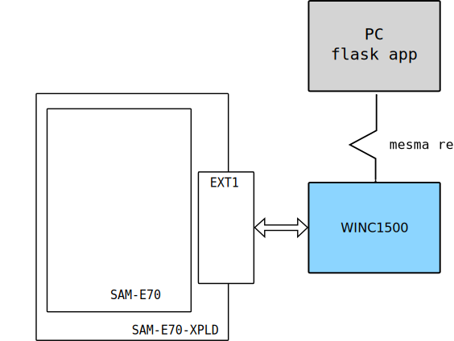
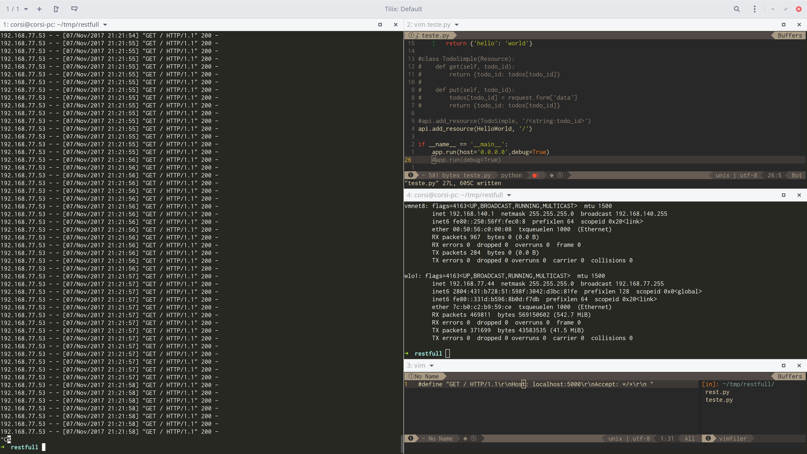

# WIFI (WINC1500) - get - EXT1

Esse exemplo, demonstra como desenvolver um firmware que é capaz de realizar `gets` em um webserver.

- Módulos: 
    - WINC1500 (módulo WIFI)
    
- Periféricos:
    - SPI
    - USART1 (debug - para comunicação com o PC - `stdio` )
    
- Pinos:
    - WINC1500
        - EXT1 5 - RESET_N  
        - EXT1 6 - WAKE
        - EXT1 9 - IRQ_N
        - EXT1 10 - CHIP_EN
        - EXT1 15 - SPI_SSN
        - EXT1 16 - SPI_MOSI
        - EXT1 17 - SPI_MISO
        - EXT1 18 - SPI_CLK
    - `stdio` / DEBUG
        - `PB4`:  UART1 
        - `PD21`: UART1
 
- APIs:
    - driver WINC1500
 
:exclamation: Pinos em conflito com EXT2
 
## Diagrama


 
## Conexão e configuração

> Conectar o WINC1500 no `EXT1` do kit de desenvolvimento. É necessário ter uma rede wifi disponível.

Esse projeto possui dois softwares:

- `python-server`: Servidor em python a ser acessado pelo embarcado
- `WIFI-get-example-EXT1`: Firmware que configura o WINC1500 

Você deve:

1. Executar o servidor python (flask) no seu 
1. Seu pc deve estar na mesma rede na qual o embarcado vai conectar
1. Configurar o `main.h` do exemplo, editando:

- A configuração da rede:

```c
/** Wi-Fi Settings */
#define MAIN_WLAN_SSID                    "Virus_Alpha" /**< Destination SSID */
#define MAIN_WLAN_AUTH                    M2M_WIFI_SEC_WPA_PSK /**< Security manner */
#define MAIN_WLAN_PSK                     "1223334444" /**< Password for Destination SSID */
```

4. IP e porta do servidor (seu pc)

```c
#define MAIN_SERVER_PORT                    (5000)
#define MAIN_SERVER_NAME                    "192.168.77.44"
```

> Para descobrir o IP, basta executar no terminal: `ifconfig`/ `ipconfig`

:exclamation: O sistema embarcado e o webserver devem estar na mesma rede!

5. Executar o firmware
6. Analisar o output no terminal 

## Resultados esperados


