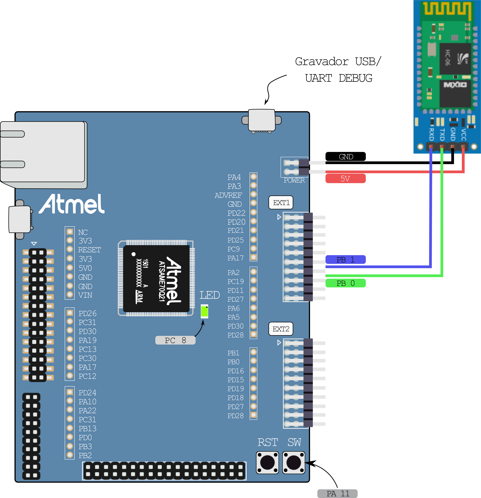
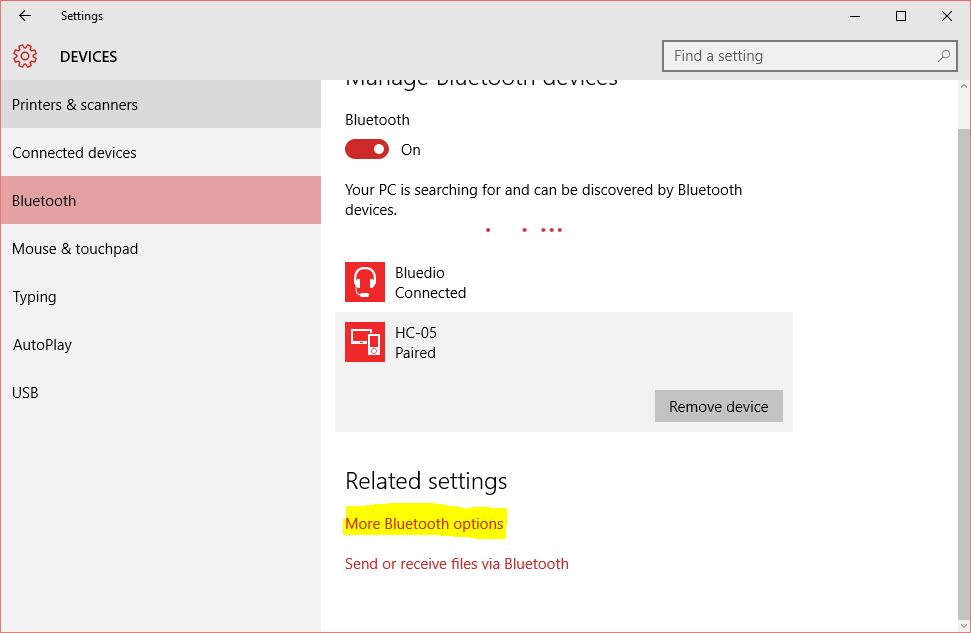
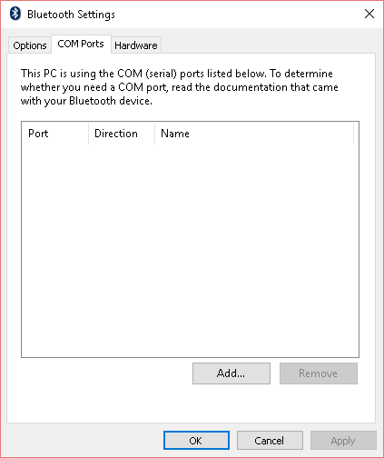

## Diagrama de conexao do HC05 ao Atmel

### **ATENÇÃO -> VCC = 5V**


# Controle

- **Roteiro apenas para sistemas operacionais Windows**

## Escolha o tipo de controle

### **Controle para Automação** (Aplicativos em gerais, Youtube, Chrome, Video Player)

- Instale os pacotes necessários do Python via PIP. Os pacotes necessários estão no arquivo requeriments.txt (dentro da pasta **PC_Python**)

- Utilizaremos o arquivo `youtube_controller.py` como base para o seu controle, ele já vem configurado para usar no Youtube com um botão configurado (botão A do controle ->  tecla L do Youtube para adiantar o vídeo em 10 segundos).

- **Primeiro:** vamos testar se o computador instalou a biblioteca de automação corretamente (`pyautogui`). Execute o arquivo `youtube_controller.py` com os parametros `none -c dummy`. 

- Isto fará com que o aplicativo em Python, inicie sem comunicar com o Bluetooth e irá simular o aperto da tecla A do controle a cada 1seg. 

- Abra um vídeo no Youtube e verifique se o vídeo fica pulando 10segs a cada segundo. Dica: para debugar quando ocorre o botão, adicione a flag `-d` no final dos parametros para mostrar mensagens de debug

- Vamos agora testar com a placa do Atmel, abra o `Atmel Studio` e o projeto exemplo do controle

- Coloque um nome diferente dos outros grupos no nome do seu Bluetooth e altere a senha da padrão (trecho do código entre as linhas **109** e **118**):

```c
|109| int hc05_server_init(void) {
|110|	char buffer_rx[128];
|111|	usart_send_command(USART0, buffer_rx, 1000, "AT", 1000);
|112|	usart_send_command(USART0, buffer_rx, 1000, "AT", 1000);	
|113|	usart_send_command(USART0, buffer_rx, 1000, "AT+NAMEMarcoMello", 1000);		//AT+NAMEnomedesejado
|114|	usart_log("hc05_server_init", buffer_rx);
|115|	usart_send_command(USART0, buffer_rx, 1000, "AT", 1000);			//AT+PINpindesejado	
|116|	usart_send_command(USART0, buffer_rx, 1000, "AT+PIN0000", 1000);
|117|	usart_log("hc05_server_init", buffer_rx);
|118| }
```

- **Compile e programe o projeto no Atmel.**

- Necessitamos agora parear o Bluetooth do computador com o HC05 do Atmel e criar uma porta serial virutal. Para isto siga o roteiro abaixo *Conectar ao HM10 via porta Serial Virtual*, depois retorne para este roteiro.

- Verifique se o Atmel conecta com o computador na porta COM configurada anteriormente, isto pode ser verificado utilizando o `Putty`, conecte na COM configurada. Se estiver conectado e funcionando você deverá ver vários (`X0` ou `X1` dependendo se o botão da placa está apertado ou não).

- Se estiver OK com o passo anterior, tente agora executar o `youtube_controller.py` com os parametros `PORTA_COM -b BAUDRATE` para conectar via serial, o controle agora deve funcionar no Youtube, aperte o botão da placa e veja se o vídeo vai para frente


### **Controle para Jogos** (Emuladores, Jogos com suporte a DirectInput/Joystick)


- Instale os pacotes necessários do Python via PIP. Os pacotes necessários estão no arquivo requeriments.txt

- Instale o `VJoy` para Windows, no qual permite criarmos um controle virtual programável para comunicarmos via Python. http://vjoystick.sourceforge.net/site/

- Copie os arquivos `vJoyInterface.dll` e `vJoyInterfaceWrap.dll` da pasta `Program Files/VJoy` ou `Arquivos de Programas/VJoy` e pasta `x86` ou `x64` (depenendo do seu sistema operacional) para a `pasta do projeto/PC_Python/pyvjoy` 

- Utilize o arquivo `game_controller.py` como base para o seu controle, ele já vem configurado para usar em um emulador com um botão configurado (botão A do controle -> botão 1 do controle virtual).

- Primeiro vamos testar se o computador instalou a biblioteca de controle virtual corretamente (`vjoy`). Execute o arquivo `game_controller.py` com os parametros `none -c dummy`. 

- Isto fará com que o aplicativo em Python, inicie sem comunicar com o Bluetooth e irá simular o aperto da tecla A do controle a cada 1seg. 

- Abra um emulador com um jogo (exemplo: NEStopia), lembre-se de configurar o controle, o emulador deve reconhecer o VJoy 1, como controle e clique na opção para trocar um dos botões, ao fazer isto com o aplicativo rodando, o emulador deve configurar aquele botão corretamente. Dica: para debugar quando ocorre o botão, adicione a flag `-d` no final dos parametros para mostrar mensagens de debug. 

- O VJoy instala um monitor para verificar o funcionamento, isto pode te auxiliar a detectar erros, você pode encontra-lo no menu Iniciar em VJoy.

- Vamos agora testar com a placa do Atmel, abra o `Atmel Studio` e o projeto exemplo do controle

- Coloque um nome diferente dos outros grupos no nome do seu Bluetooth e altere a senha da padrão, compile e programe o projeto no Atmel.

- Necessitamos agora parear o Bluetooth do computador com o HC05 do Atmel e criar uma porta serial virutal. Para isto siga o roteiro abaixo *Conectar ao HM10 via porta Serial Virtual*, depois retorne para este roteiro.

- Verifique se o Atmel conecta com o computador na porta COM configurada anteriormente, isto pode ser verificado utilizando o `Putty`, conecte na COM configurada. Se estiver conectado e funcionando você deverá ver vários (`X0` ou `X1` dependendo se o botão da placa está apertado ou não).

- Se estiver OK com o passo anterior, tente agora executar o `game_controller.py` com os parametros `PORTA_COM -b BAUDRATE` para conectar via serial, o controle agora deve funcionar no emulador, aperte o botão da placa e veja se o botão é pressionado no jogo.


## Conectar ao HM10 via porta Serial Virtual

- Procure no Windows 10, as configurações de Bluetooth igual a imagem abaixo. Realize o pareamento com o HC05 do seu grupo. Em seguida, clique em "Mais configurações de Bluetooth" conforme marcado em amarelo.    


- Procure por "Portas COM" e clique em adicionar    


- Selecione como porta de saída e o HC05 do seu grupo. E o serviço Dev B.  


- Tente testar a conexão atráves do `PuTTY` ou qualquer outro aplicativo de terminal serial.
