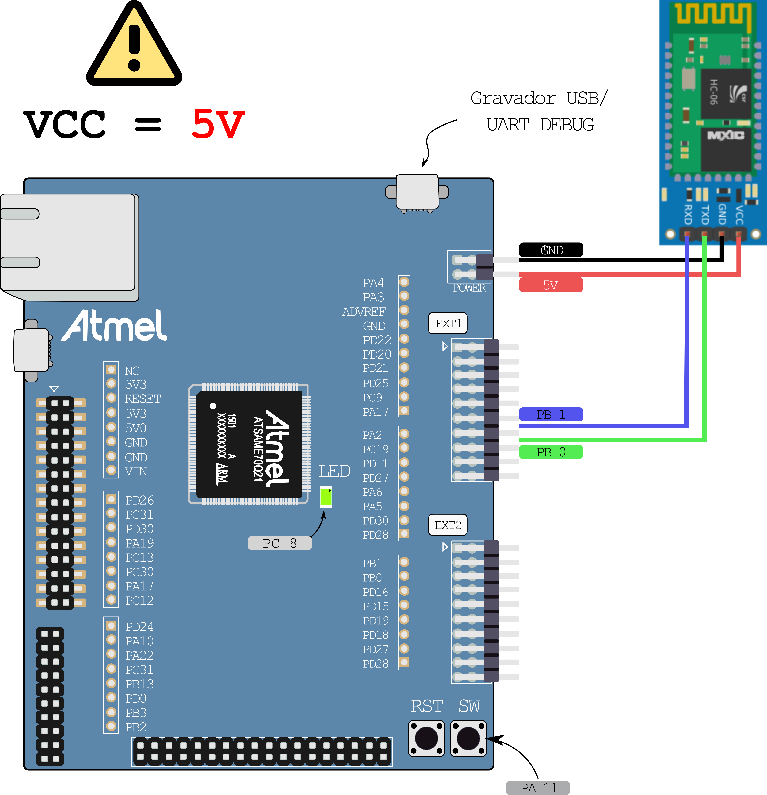

# Bluetooth HC-05

Exemplo de como usar o bluetooth HC-05 com o kit de desenvolvimento
SAME70-XPLD.

O [HC-05](https://www.itead.cc/wiki/Serial_Port_Bluetooth_Module_(Master/Slave)_:_HC-05)
é um módulo bluetooth popular (R$15) que pode funcionar como
device ou host, neste exemplo usaremos como device (conectando-se ao
computador). O Computador (windows) verá o módulo HC-05 como um dispositivo
bluetooth, e uma vez pareado e conectado o Windows irá criar uma porta
COM (serial) associado a conexão, nessa porta faremos a recepção e 
envio dos dados via bluetooth.

O modulo será conectado ao microcontrolador através de uma comunicação
UART (a mesma que vocês implementaram em camada física), o microcontrolador
pode enviar dados para o computador por esta porta (TX) ou receber
dados do computador (RX), conforme diagrama a seguir:

``` 
    +----------+            +-------+             +----------+
    |    +-----|            |       |   <---->    |    +-----|
    |    |USART| ----tx---> |       |             |    | COM <---> python
    |    +-----| <---rx---- |       |  BLUETOOTH  |    +-----|
    | uc       |            | HC-05 |             | PC       |
    +----------+            +-------+             +----------+
```

No microcontrolador iremos usar um periférico chamado de USART para
realizar a serialização e desserialização do dado no protocolo UART.
A comunicação com o módulo HC-05 segue um protocolo chamado de 
[**AT Command**](https://www.itead.cc/wiki/Serial_Port_Bluetooth_Module_(Master/Slave)_:_HC-05).

Já no computador iremos usar um programa em python que acessará 
a porta COM criada pelo windows para enviar e receber dados do
microcontrolador via protocolo bluetooth.

Note que estamos lidando com o bluetooth de forma "transparente",
apenas como "usuários", toda a mágica acontece dentro do HC-05.

## Exemplo

Esse exemplo é composto de duas partes:

- **/firmware**: Código C para executar no microcontrolador
- **/python**: Código python para executar no computador

O firmware pode operar de duas maneira: conectado ao bluetooth ou não. 
Isso é definido no firmware descomentando o define: 

```c
#define DEBUG_SERIAL
```

Já o exemplo em `python` é para ser executado no computador, e temos
dois exemplos disponíveis: 

1. `game_controller` : emula um teclado
1. `youtube_controller` : emula um joystick 

## Conectando

**ATENÇÃO -> VCC = 5V**



### firmware

Abra o projeto `firmware` no MicrochipStudio. Antes lembre de conectar o bluetooth como indicado anteriormente.

Vamos modificar o firmware alterando o nome e a senha do bluetooth. 
Para isso será necessário alterar a função `hc05_init` nos comandos de configuração
que configuram o nome e a senha do device: `AT+NAME` e `AT+PIN`.

O exemplo configura o bluetooth com o nome `MarcoMello` e senha `0000`:

- `AT+NAMEMarcoMello`
- `AT+PIN0000`

Para alterar o nome e a senha (4 dígitos) basta alterar:

- `AT+NAMExxxxxxxx`
- `AT+PINyyyy`

Tudo isso na função `hc05_init`:

```c
int hc05_init(void) {
    // ....
	usart_send_command(USART0, buffer_rx, 1000, "AT+NAMEMarcoMello", 1000); 
    // ....
	usart_send_command(USART0, buffer_rx, 1000, "AT+PIN0000", 1000);
 }
```

**Compile e programe o projeto**

### Conectando ao HC-05 

Procure no Windows 10 as configurações de Bluetooth igual a imagem abaixo. Realize o pareamento com o HC05 do seu grupo. Em seguida, clique em "Mais configurações de Bluetooth" conforme marcado em amarelo.   


Procure por "Portas COM" e clique em adicionar:


Selecione como porta de saída e o HC05 do seu grupo. E o serviço Dev B.:


Verifique se placa conecta com o computador na porta COM configurada anteriormente, isto pode ser verificado utilizando o software [PuTTy](https://www.putty.org), conecte na COM configurada. Se estiver conectado e funcionando você deverá ver vários (`X0` ou `X1` dependendo se o botão da placa está apertado ou não).

### Escolhendo exemplo

Agora você deve seguir o exemplo para o tipo de controle que quer executar:

- [PC - Controle para Automação]( https://github.com/Insper/SAME70-examples/tree/master/Demos/HC05-Controle-Exemplo#pc---controle-para-automa%C3%A7%C3%A3o)

- [PC - Controle para Jogos](https://github.com/Insper/SAME70-examples/tree/master/Demos/HC05-Controle-Exemplo#pc---controle-para-jogos)

## PC - **Controle para Automação** 

**Você deve escolher esse exemplo se quiser fazer um controle para aplicativos em geral, exemplo: Youtube, Chrome, Video Player.**

Instale os pacotes necessários do Python via PIP. Os pacotes necessários estão no arquivo `requeriments.txt` (dentro da pasta `python/`):

``` bash
pip3 install -r requirements.txt
```

Utilize o arquivo `youtube_controller.py` como base para o seu controle, ele já vem configurado para usar no Youtube com um botão configurado (botão A do controle ->  tecla L do Youtube para adiantar o vídeo em 10 segundos).

**Primeiro:** vamos testar se o computador instalou a biblioteca de automação corretamente (`pyautogui`).

Execute o arquivo `youtube_controller.py` com os parametros `none -c dummy`. 

``` bash
python3 youtube_controller.py none -c dummy
```

Isto fará com que o aplicativo em Python, inicie sem comunicar com o Bluetooth e irá simular o aperto da tecla A do controle a cada 1 seg. 

Abra um vídeo no Youtube e verifique se o vídeo fica pulando 10s a cada segundo. Dica: para debugar quando ocorre o botão, adicione a flag `-d` no final dos parametros para mostrar mensagens de debug.

### Testando com a placa

Necessitamos agora parear o Bluetooth do computador com o HC-05 e criar uma porta serial virtual. Para isto siga você deve ter realizado o roteiro `Conectando ao HC-05`, depois retorne para este roteiro.

Se estiver tudo certo com o passo anterior, tente agora executar o `youtube_controller.py` com os parametros `PORTA_COM -b 115200` para conectar via serial, o controle agora deve funcionar no Youtube, aperte o botão da placa e veja se o vídeo vai para frente

- `PORTA_COM `: porta do windows que o bluetooth conectou

### Pronto!

Agora você pode seguir o desenvolvimento do seu projeto!

## PC - **Controle para Jogos**

**Você deve escolher esse exemplo se quiser desenvolver um controle para emuladores, Jogos com suporte a DirectInput/Joystick.**

Siga os passos a seguir:

- Instale os pacotes necessários do Python via PIP. Os pacotes necessários estão no arquivo `requeriments.txt` (dentro da pasta `python/`):

``` bash
pip3 install -r requirements.txt
```

Instale o `VJoy` para Windows, no qual permite criarmos um controle virtual programável para comunicarmos via Python: http://vjoystick.sourceforge.net/site/

Copie os arquivos `vJoyInterface.dll` e `vJoyInterfaceWrap.dll` da pasta `Program Files/VJoy` ou `Arquivos de Programas/VJoy` e pasta `x86` ou `x64` (depenendo do seu sistema operacional) para a `pasta do projeto/PC_Python/pyvjoy` 

Utilize o arquivo `game_controller.py` como base para o seu controle, ele já vem configurado para usar em um emulador com um botão configurado (botão A do controle -> botão 1 do controle virtual).

Primeiro vamos testar se o computador instalou a biblioteca de controle virtual corretamente (`vjoy`). Execute o arquivo `game_controller.py` com os parametros `none -c dummy`. 

``` bash
python3 youtube_controller.py none -c dummy
```

Isto fará com que o aplicativo em Python, inicie **sem comunicar** com o Bluetooth e irá simular o aperto da tecla A do controle a cada 1seg. 

Abra um emulador com um jogo (exemplo: NEStopia), lembre-se de configurar o controle, o emulador deve reconhecer o `VJoy 1`, como controle e clique na opção para trocar um dos botões, ao fazer isto com o aplicativo rodando, o emulador deve configurar aquele botão corretamente. Dica: para debugar quando ocorre o botão, adicione a flag `-d` no final dos parametros ao rodar o python para mostrar mensagens de debug. 

O VJoy instala um monitor para verificar o funcionamento, isto pode te auxiliar a detectar erros, você pode encontra-lo no menu Iniciar em VJoy.

### Testando com a placa

Necessitamos agora parear o Bluetooth do computador com o HC-05 e criar uma porta serial virtual. Para isto siga você deve ter realizado o roteiro `Conectando ao HC-05`, depois retorne para este roteiro.

Se estiver tudo certo com o passo anterior, tente agora executar o `game_controller.py` com os parametros `PORTA_COM -b 115200` para conectar via serial, o controle agora deve funcionar no Youtube, aperte o botão da placa e veja se o vídeo vai para frente

- `PORTA_COM `: porta do windows que o bluetooth conectou

### Pronto!

Agora você pode seguir o desenvolvimento do seu projeto!
