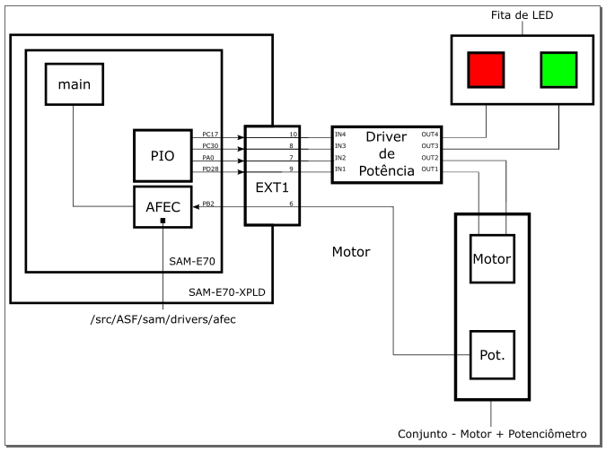

* Teclado Matricial + Display LCD 16x2 (Modo 4 Bits)
* Marco Mello - marcoasma@insper.edu.br
* 20/03/2019

# Resumo :

Esse exemplo demonstra como é feita a leitura do potenciômetro e acionado o motor do mesmo.

Periféricos uC:

    - Power Managment Controller (PMC)
    - GPIO
    - AFEC
 
Componentes : 

    - Slide Pot - Motorized
    - Driver Motor ponte-H - L298N
    - Fita de LED RGB

## Diagrama

## Demonstração

https://www.youtube.com/watch?v=QDkPhp0zf0g

## Funcionamento

A leitura do potenciômetro é efetuada, fazendo com que o motor gire, buscando a posição definida no código(50% nesse exemplo), sendo 0% o início do percurso e 100% o fim.
Quando a leitura do potenciômetro está abaixo de 50%, o motor gire no sentiro horário, até alcançar a posição equivalente a 50%, quado a leitura está acima o motor gira
em sentido anti-horário.
Esse exemplo também possui uma fita de letira para ilustrar quando a posição está correta, acendendo verde e quando a posição está incorreta, acendendo vermelho.
