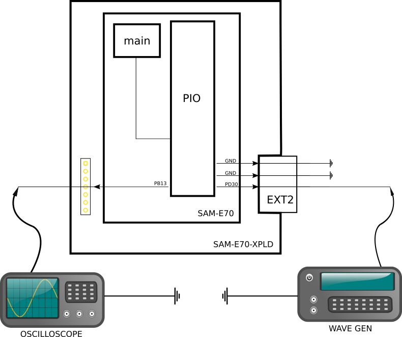

* Processamento de Sinais + Buffer Ping Pong (modulo externo)
* Sabrina Simão - sabrinass@al.insper.edu.br
* 30/04/2019

# Resumo :

Esse exemplo demonstra como interfacear o conversor analógico-digital (AFEC) com o conversor digital-analógico (DAC) para receber um sinal de input e criar um sinal de saída transformado

Periféricos uC:

- Analog to Digital Controller (DAC)
- Analog Front End Controller (AFEC)

   
Equipamentos : 

- Gerador de Sinais
- Osciloscópio

Pinos específicos :

1) DAC
- DAC0 -> PB13
- GND

2) AFEC
- AFEC0 -> PD30
- GND

## Diagrama

## Funcionamento

Um sinal analógico entra através dos cabos GND e PD30, onde é armazenado na memória interna via o módulo do Buffer Ping Pong. Este sinal pode ser alterado e processado, e depois é convertido novamente em sinal digital pelo DAC e sua saída é o pino PB13 com GND.

O Buffer Ping Pong é um módulo feito para evitar lag no output do sinal, e seu funcionamento segue o diagrama a seguir:

Assim, um bloco de sinais vai sendo armazenado in real time enquanto o já preenchido começa a ser processador pelo uC. Quando este bloco estiver pronto para sair e o outro estiver cheio, há uma troca entre buffers ativos, e o primeiro começa a ser preenchido enquanto o segundo é processado. Claro que o tamanho de tal buffer deve sempre ser estudado para cada aplicação. 

## Observações

Para gerar o sinal, fique atento ao cabo de entrada. No caso do Wave Gen Tektronix, é necessário um cabo video com no mínimo 4mm, 75omhs e ponta conectora do wavegen. Outras formas de capturar sinal podem ter conexão direta com o barramento do uC, então sempre ficar atento (microfones, por exemplo).

## Dica

Para gerar uma onda que consiga ser coletada pelo buffer, processada e retornada pelo uC, qual uma frequência e amplitude boa? Lembre-se:
> De acordo com o Teorema de Nyquist, uma taxa de amostragem de no mínimo duas vezes o valor da frequência máxima alcançada pelo sinal analógico é necessária para possibilitar o registro digital de todas as frequências analisadas. Esta taxa de amostragem mínima desejada é chamada frequência de Nyquist. 

## Referências

Módulo Externo Buffer ping-pong
> https://github.com/uLipe/ping_pong_buffer