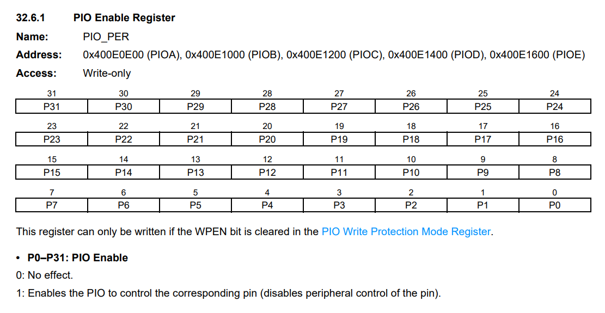
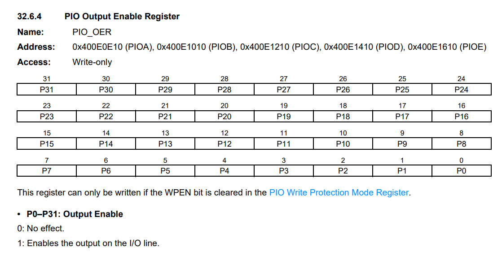
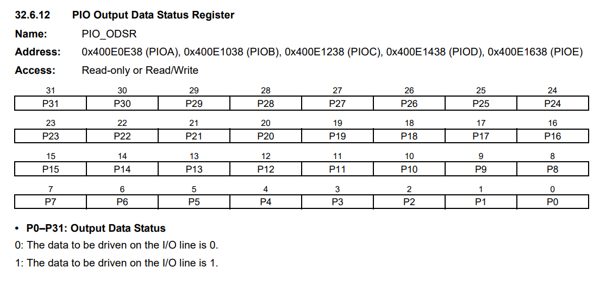
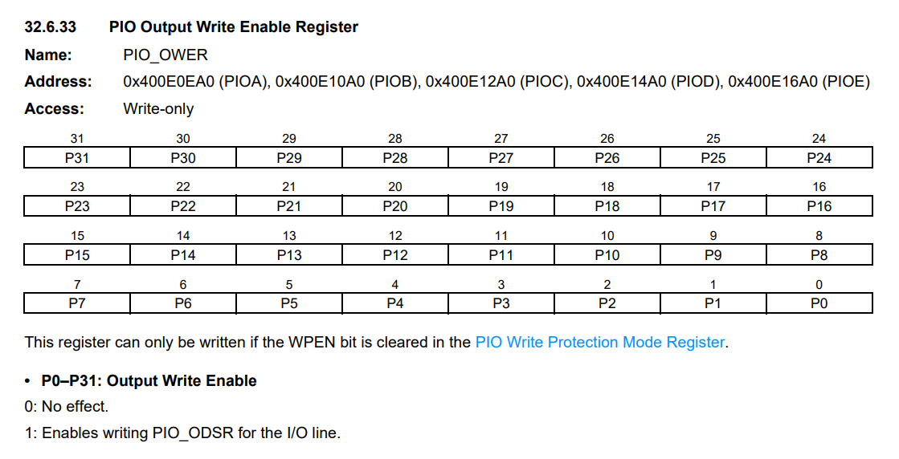
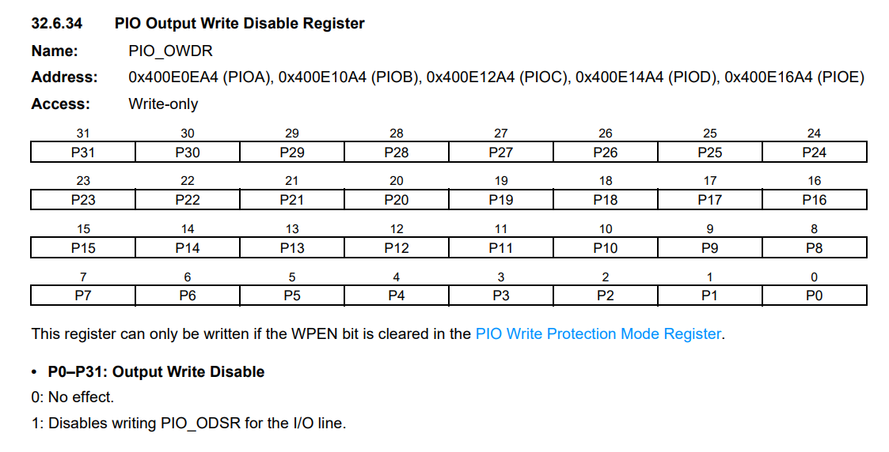
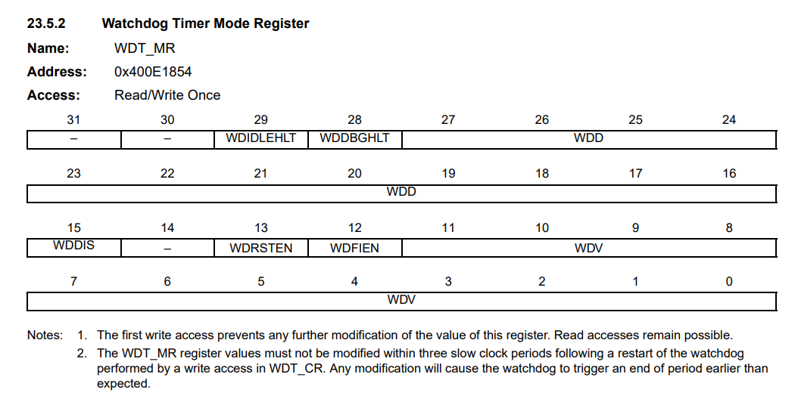

# Rust - Blink LED

Como utilizar a linguagem Rust para criar programas no processador Cortex M7 (utilizado na place SAME70)

## O que é Rust?


A linguagem Rust é relativamente nova, pois a primeira versão de código aberto foi lançada em 2010 pela Mozilla. Ela é utilizada para o desenvolvimento de diferentes tipos de aplicações, como ferramentas de linha de comando, web services, ferramentas para DevOps, jogos, aplicativos de IoT — Internet of Things — e muito mais.

As características da linguagem permitem que ela tenha performance suficiente para ser utilizada tanto no desenvolvimento de sistemas de nível mais baixo quanto no de aplicações de alto nível. Não é à toa que ela surgiu como uma alternativa para o C++, entretanto, com algumas características mais modernas, que ajudam a evitar falhas e problemas de segurança.

## Por que Rust?


### Analise estática poderosa

Garanta a configuração de pinos e periféricos durante o tempo de compilação. Garanta que recursos não serão usados de maneira não intencional por partes da sua aplicação.

### Memória flexível

Alocação dinâmica de memória é opcional. Use um alocador global e estruturas de dados dinâmicas. Ou evite o heap e aloque tudo estaticamente.

### Concorrência sem medo

Rust torna impossível compartilhar estado acidentalmente entre threads. Use o método de concorrência que preferir, e você manterá as fortes garantias de Rust.

### Interoperabilidade

Integre Rust em sua base de código atual em C, ou aproveite SDKs existentes para escrever suas aplicações em Rust

### Portabilidade

Escreva bibliotecas ou drivers uma vez, e use-os em diversos sistemas, desde pequenos microcontroladores até poderosos SBCs.

### Conduzido pela Comunidade

Como parte do projeto Rust de código aberto, o suporte para sistemas embarcados é movido por uma das melhores comunidades abertas, com suporte de parceiros comerciais.

## Ferramental

Lidar com microcontroladores envolve o uso de várias ferramentas diferentes, pois estaremos lidando com uma arquitetura diferente da do seu laptop e teremos que executar e depurar programas em um dispositivo remoto.

Usaremos todas as ferramentas listadas abaixo. Qualquer versão recente deve funcionar quando uma versão mínima não for especificada, mas listamos as versões que testamos.

- Rust
- cargo-binutils
- qemu-system-arm (caso você queira testar sem subir o código para a placa)
- OpenOCD
- GDB com suporte ARM

O texto abaixo explica por que estamos usando essas ferramentas. As instruções de instalação podem ser encontradas na próxima seção.

### cargo-binutils

load-binutils é uma coleção de subcomandos Cargo (gerenciador de pacotes do Rust, tipo o NPM em JS) que facilitam o uso das ferramentas LLVM que são enviadas com a cadeia de ferramentas Rust. Essas ferramentas incluem as versões LLVM de objdump, nm e size e são usadas para inspecionar binários.

### qemu-system-arm

QEMU é um emulador. Nesse caso, usamos a variante que pode emular totalmente os sistemas ARM. Usamos o QEMU para executar programas embutidos no host. Graças a isso, você pode acompanhar algumas partes do tutorial, mesmo que não tenha nenhum hardware com você!

### GDB

Um depurador é um componente muito importante do desenvolvimento incorporado, pois você nem sempre pode se dar ao luxo de registrar coisas no console do host. Em alguns casos, você pode nem ter LEDs para piscar no seu hardware!

### OpenOCD

O GDB não é capaz de se comunicar diretamente com o hardware de depuração em sua placa de desenvolvimento SAME70. Ele precisa de um tradutor e o Open On-Chip Debugger, OpenOCD, é esse tradutor. OpenOCD é um programa que roda em seu laptop.

## Instalação

### Instalação do Rust

- Instale o rustup seguindo as instruções em https://www.rust-lang.org/pt-BR/tools/install
- Após instalar, verifique se a versão do compilador é maior do que a 1.31, com o commando:

```
$ rustc -V
rustc 1.61.0 (fe5b13d68 2022-05-18)
```

- Por questões de largura de banda e uso de disco, a instalação padrão suporta apenas compilação nativa (para o seu x86-64, por exemplo). Para adicionar suporte de compilação cruzada para as arquiteturas ARM Cortex-M, escolha um dos seguintes destinos de compilação. Para a placa SAME-70 usada para os exemplos, use o destino thumbv7em-none-eabihf.

```
Cortex-M0, M0+, and M1 (ARMv6-M architecture):
$ rustup target add thumbv6m-none-eabi

Cortex-M3 (ARMv7-M architecture):
$ rustup target add thumbv7m-none-eabi

Cortex-M4 and M7 without hardware floating point (ARMv7E-M architecture):
$ rustup target add thumbv7em-none-eabi

Cortex-M4F and M7F with hardware floating point (ARMv7E-M architecture):
$ rustup target add thumbv7em-none-eabihf

Cortex-M23 (ARMv8-M architecture):
$ rustup target add thumbv8m.base-none-eabi

Cortex-M33 and M35P (ARMv8-M architecture):
$ rustup target add thumbv8m.main-none-eabi

Cortex-M33F and M35PF with hardware floating point (ARMv8-M architecture):
$ rustup target add thumbv8m.main-none-eabihf
```

### Cargo-binutils

```
$ cargo install cargo-binutils

$ rustup component add llvm-tools-preview
```

### GDB e openocd

```
$ sudo apt install gdb-multiarch openocd
```

### Clone o Repositório

- Por fim, clone este repositório com o exemplo do Blink LED

## Conhecendo o Hardware

Antes de começarmos, você precisa identificar algumas características do dispositivo de destino, pois elas serão usadas para configurar o projeto:

- O Core ARM. por exemplo, Cortex-M7.

- O núcleo ARM inclui uma FPU (Floating Point Unit)? Os cores Cortex-M7**F** sim.

- Quanta memória Flash e RAM o dispositivo de destino possui? por exemplo, 256 KiB de Flash e 32 KiB de RAM.

- Onde a memória Flash e a RAM são mapeadas no espaço de endereço? por exemplo, a RAM geralmente está localizada no endereço 0x2000_0000.

Você pode encontrar essas informações na folha de dados ou no manual de referência do seu dispositivo.

Nesta seção, usaremos nosso hardware de referência, o SAME70. Este microcontrolador possui:

- Um núcleo Cortex-M7F que inclui um único FPU de precisão


- 2 Mbytes de Flash localizado no endereço 0x00400000.


- 384 KBytes de RAM localizados no endereço 0x20400000. (Existem outras regiões de RAM, mas para simplificar, vamos ignorá-las).


## Configurando

1. O passo número um é definir um destino de compilação padrão em `.cargo/config.toml`.

```
# Pick ONE of these compilation targets
# target = "thumbv6m-none-eabi"    # Cortex-M0 and Cortex-M0+
# target = "thumbv7m-none-eabi"    # Cortex-M3
# target = "thumbv7em-none-eabi"   # Cortex-M4 and Cortex-M7 (no FPU)
target = "thumbv7em-none-eabihf" # Cortex-M4F and Cortex-M7F (with FPU)
```

Usaremos o thumbv7em-none-eabihf, pois cobre o Cortex-M7F.

2. A segunda etapa é inserir as informações da região de memória no arquivo `memory.x`.

```
/* Memory Spaces Definitions */
MEMORY
{
  FLASH  : ORIGIN = 0x00400000, LENGTH = 0x00200000
  RAM : ORIGIN = 0x20400000, LENGTH = 0x00060000
}
```

## Overview do Programa

Por conveniência, aqui estão as partes mais importantes do código-fonte em `src/main.rs`

```rust
#![no_std]
#![no_main]

use panic_halt as _;

use cortex_m_rt::entry;

#[entry]
fn main() -> ! {

    let pioc_per: *mut i32  = 0x400e1200 as *mut i32;
    let pioc_oer: *mut i32  = 0x400e1210 as *mut i32;
    let pioc_odsr: *mut i32  = 0x400e1238 as *mut i32;
    let pioc_ower: *mut i32  = 0x400e12a0 as *mut i32;
    let pioc_owdr: *mut i32  = 0x400e12a4 as *mut i32;
    let wdt_mr: *mut i32  = 0x400e1854 as *mut i32;

    unsafe {
        *wdt_mr = 0x000080000; // Disable watchdog timer.

        *pioc_per = 0x100;
        *pioc_oer = 0x100;
        *pioc_owdr = 0;
        *pioc_ower = 0x100;
    }

    loop {
        unsafe {
            *pioc_odsr  ^= 0x100;
        }

        for _wait in 0..10000 {}
    }
}
```

Este programa é um pouco diferente de um programa Rust padrão, então vamos dar uma olhada mais de perto.

- #![no_std] indica que este programa não será vinculado ao compilador 'std'. Em vez disso, ele será vinculado ao seu subconjunto: o compilador 'core'.

- #![no_main] indica que este programa não usará a interface principal padrão que a maioria dos programas Rust usa.

- use panic*halt como *;. Este padrão fornece um panic_handler que define o comportamento de pânico do programa.

- #[entry] é um atributo fornecido pela biblioteca cortex-m-rt que é usada para marcar o ponto de entrada do programa. Como não estamos usando a interface principal padrão, precisamos de outra maneira de indicar o ponto de entrada do programa, que seria #[entry].

- fn main() -> !. Nosso programa será o único processo em execução no hardware de destino, então não queremos que ele termine! Usamos uma função divergente (o -> ! bit na assinatura da função) para garantir que em tempo de compilação seja esse o caso.

- 
- 
- 
- 
- 
- 

## Compilando o código

Para compilar o código é muito simples, execute o comando:

- Para testar:
  ```
  $ cargo build
  ```
- Para produção:
  ```
  $ cargo build --release
  ```
- Para limpar:
  ```
  $ cargo clean
  ```

Após executar o comando de build, uma pasta target será gerada. Nela, dentro de thumbv7em-none-eabihf, teremos duas opções, debug para o código teste e release para o código de produção.

Dentro de cada uma dessas pastas teremos os arquivos executáveis `blink-led` (sem extensão), que será usado para rodar o código na placa.

## Rodando o código sem Debugger

Primeiro, vá para o caminho onde está o executável:

1. `$ cd thumbv7em-none-eabihf/release` ou `$ cd thumbv7em-none-eabihf/debug`

2. Execute em um terminal o comando:

`$ openocd -f board/atmel_same70_xplained.cfg -c "init" -c "program blink-led verify reset exit"`

3. Pronto! Seu código agora está rodando na placa!

## Rodando o código com GDB

Para rodar o código com o GDB, devemos primeiro executar o openocd em outro terminal

1. `$ openocd -f board/atmel_same70_xplained.cfg`

Depois executamos o gdb com o script `openocd.gdb` que está nesse repositório

2. `$ gdb -x openocd.gdb target/thumbv7em-none-eabihf/debug/blink-led` ou simplesmente rode `$ cargo run`
