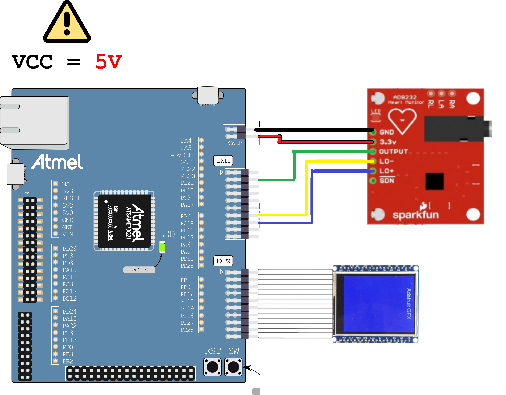
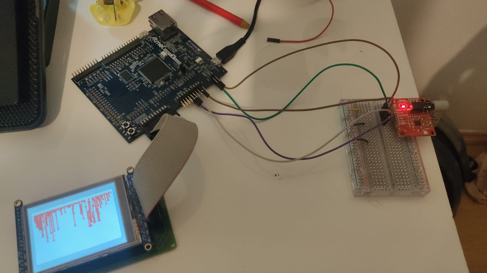
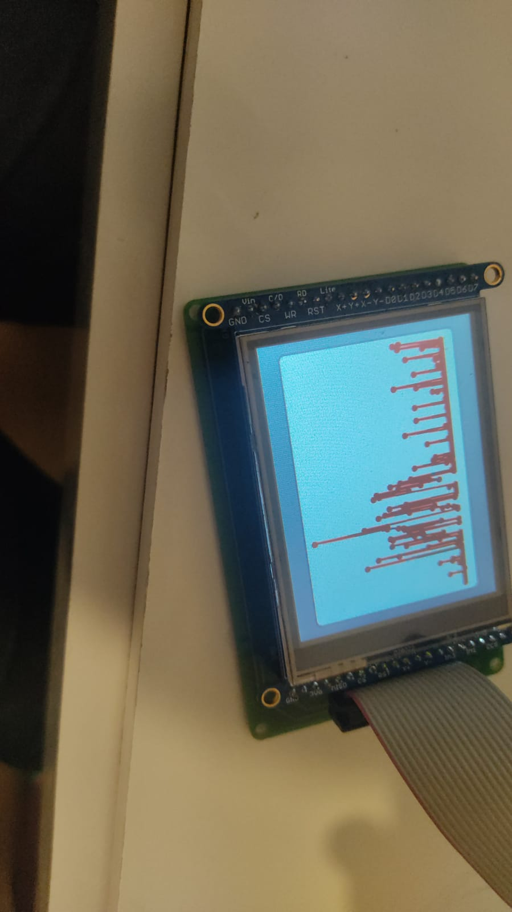

# SparkFun Single Lead Heart Rate Monitor - AD8232

Exemplo de como usar o sensor de batimentos cardíacos com o kit de desenvolvimento SAME70-XPLD.
<div align="center">
    
</div>

O AD8232 é um pequeno chip usado para medir a atividade elétrica do coração. Esta atividade elétrica pode ser mapeada como um ECG ou Eletrocardiograma. A eletrocardiografia é usada para ajudar a diagnosticar várias doenças cardíacas, apesar deste sensor em específico **não ser indicado para detecção ou diagnóstico de qualquer anomalia ou distúrbio**.

## Entendo na prática o que é o ECG
De maneira simples, o ECG  pode ser definido em  dois intervalos básicos, o intervalo PR e o intervalo QT, descritos abaixo.
<div align="center">
    
</div>

* Intervalo PR

Este intervalo é primeira onda gerada por um impulso elétrico, que parte do átrio direito do coração, até o esquerdo. Esse impulso gera uma dispolarização entre as câmaras, forçando a contração e drenamento de sangue não oxigenado das veias superiores para as inferiores do ventrículo direito. Conforme o estímulo elétrico viaja pela parte superior do coração, ele força a contração do átrio esquerdo, que é responsável por receber sangue oxigenado advindo dos pulmões.


* Intervalo QT

O intervalo QT é onde as coisas ficam realmente interessantes. O QRS é um processo complexo que gera a assinatura “bip” (pico) nos monitores cardíacos. Durante o QRS, ambos os ventrículos começam a bombear. O ventrículo direito começa a bombear sangue desoxigenado para os pulmões através das artérias pulmonares esquerda e direita.  O ventrículo esquerdo começa a bombear sangue recém-oxigenado pela aorta e para o resto do corpo. 
Após a contração inicial vem o segmento ST. O segmento ST é bastante silencioso eletricamente, pois é o momento em que os ventrículos aguardam para serem "repolarizados". Finalmente, a onda T torna-se presente para "repolarizar" ativamente, ou relaxar os ventrículos. 
Essa fase de relaxamento redefine os ventrículos para serem novamente preenchidos pelos átrios.

Esses processos podem ser vistos de maneira mais adequada com a imagem abaixo. Conseguimos captar esses diferentes estímulos, ao colocar detectores em flancos direitos e esquerdos do corpo, que "fecham" o circuito com os átrios, permitindo a detecção destes via kit de desenvolvimento.

<div align="center">
    
</div>

## Conectando
Para a montagem utilizou-se os seguintes pinos: 
<div align="center">

| Label na placa  | PINO  | Função|
|---------|-----------------|-------|
| GND  |        GND         | Aterramento  |
| 3.3V   |        3.3V         | Alimentação| 
| OUTPUT |         PC31      | Leitura Analógica|
| LO- |         PC17      | Leitura digital de threshold mínima|
| LO+ |         PA4      |Leitura digital de threshold máxima|
| LVGL |         EXT2      |Visualização gráfica de ECG|


</div>

Visualmente a montagem deve seguir o seguinte padrão:
<div align="center">
    
</div>

<div align="center">
    
</div>

Após a montagem dos componentes eletrônicos, conecte o cabo de três sensores Pads à entrada de captação.

O sensor tem relativa instabilidade, e as conexões Pads, para melhores medições, devem ser colocadas em pontos próximos ao coração além de respeitar o lado correto de sua indicação (escrito "R" [Direita] ou "L"[Esquerda] em cada Pad). Nota-se que apesar destes cuidados, o sensor pode não ter valores totalmente adequados, mas quanto mais menos movimentos (devido a menor ativação muscular), melhor os resultados se mostram. O posicionamento dos Pads pode ser feito conforme nos esquemas abaixo:
<div align="center">
    
</div>

## Exemplo
Esta demo tem sua parte principal dentro da pasta **src**.

Para a leitura analógica dos valores gerados pelo sensor, configurou-se o AFEC1, no canal 6 (pino PC31).
Foram captadas amostras a cada 250Hz, e cada valor lido, fora enviado para a task de processamento (task_adc) que, caso dado seja válido, envia para task de ilustração gráfica do ECG.

```c
#define AFEC_POT AFEC1
#define AFEC_POT_ID ID_AFEC1
#define AFEC_POT_CHANNEL 6 // Canal do pino PC31

static void task_adc(void *pvParameters) {
  /* Código */   
  config_AFEC_pot(AFEC_POT, AFEC_POT_ID, AFEC_POT_CHANNEL, AFEC_pot_callback);
  xTimer = xTimerCreate("Timer",
                        250,       // amostragem escolhida         
                        pdTRUE,                      
                        (void *)0,
                        vTimerCallback);
  xTimerStart(xTimer, 0);
  adcData adc;
  while (1) {
    /* Omitindo parte do código */
     else if(xQueueReceive(xQueueADC, &(adc), 1000)) {
      	printf("ADC: %d \n", adc);
	  	xQueueSend(xQueueECG,&adc.value,0);
    }
  }
}
```

Para leitura digital dos valores de Leads off - e Leads off +, com dois tipos de detecção (AC e DC). Segundo fabricante essas detecções ocorrem da seguinte forma:

>**DC Leads Off Detection**

>The dc leads off detection mode is used in three-electrode configurations only. It works by sensing when either instrumentation
>amplifier input voltage is within 0.5 V from the positive rail. In
>this case, each input must have a pull-up resistor connected to the
>positive supply. During normal operation, the subject’s potential
>must be inside the common-mode range of the instrumentation
>amplifier, which is only possible if a third electrode is connected
>to the output of the right leg drive amplifier. 

>**AC Leads Off Detection**

>The ac leads off detection mode is useful when using two
>electrodes only (it does not require the use of a driven electrode).
>In this case, a conduction path must exist between the two
>electrodes, which is usually formed by two resistors, as shown
>in Figure 51.
>These resistors also provide a path for bias return on each input.
>Connect each resistor to REFOUT or RLD to maintain the inputs
>within the common-mode range of the instrumentation
>amplifier. 

Dessa, maneira, configurou-se a leitura desses Outputs digitais para condição de verificação de adequação na medida
```c
#define LO_MINUS_PIO PIOC
#define LO_MINUS_PIO_ID ID_PIOC
#define LO_MINUS_IDX 17
#define LO_MINUS_IDX_MASK (1u << LO_MINUS_IDX)

#define LO_PLUS_PIO PIOA
#define LO_PLUS_PIO_ID ID_PIOA
#define LO_PLUS_IDX 4
#define LO_PLUS_IDX_MASK (1u << LO_PLUS_IDX)

void io_init(void) {
	// Configura-se leitura de output digital com Pull-up desligado
	pmc_enable_periph_clk(LO_MINUS_PIO_ID);
	pmc_enable_periph_clk(LO_PLUS_PIO_ID);
	
	pio_set_input(LO_MINUS_PIO, LO_MINUS_IDX_MASK, PIO_DEFAULT);
	pio_pull_up(LO_MINUS_PIO, LO_MINUS_IDX_MASK, 0);
	
	pio_set_input(LO_PLUS_PIO, LO_PLUS_IDX_MASK, PIO_DEFAULT);
	pio_pull_up(LO_PLUS_PIO, LO_PLUS_IDX_MASK, 0);
}

static void task_adc(void *pvParameters) {
  // Inicia pinos digitais
  io_init();
  /* Omitindo parte do código */
  while (1) {
	//Detecta se os pulsos identificados est�o na threshold do fabricante (filtro passa altas), 
	// se recebe algo nesse sinal digital, não deve exibir o pulso. Segundo o fabricante:
	/* The AD8232 includes a fast restore function that reduces the
	duration of otherwise long settling tails of the high-pass filters.
	After an abrupt signal change that rails the amplifier (such as a
	leads off condition), the AD8232 automatically adjusts to a
	higher filter cutoff. This feature allows the AD8232 to recover
	quickly, and therefore, to take valid measurements soon after
	connecting the electrodes to the subject.                                                                */
	if (pio_get(LO_MINUS_PIO,PIO_INPUT,LO_MINUS_IDX_MASK) || pio_get(LO_PLUS_PIO,PIO_INPUT,LO_PLUS_IDX_MASK)){ 
		   printf("-\n");
	}
     /* Omitindo parte do código */
  }
}
```

Posteriormente, deve-se realizar a exibição gráfica do ECG. Utilizando o display Adafruit, com apoio da biblioteca gráfica LVGL, iremos utilizar o wigdet **lv_chart**, que irá ilustrar os pulsos detectados. Desse modo, declara-se variáveis globais necessárias:
```c
/*Vetor de alocação dos pontos a serem mostrados pelo ECG*/
#define CHAR_DATA_LEN 250
int ser1_data[CHAR_DATA_LEN];
lv_obj_t * chart;
lv_chart_series_t * ser1;
```
 Define-se então a função de construção da tela inicial:

 ```c
/* Tela de amostragem do ECG                         */
void lv_screen_chart(void) {
	chart = lv_chart_create(lv_scr_act());
	lv_obj_set_size(chart, 300, 200);
	lv_obj_align(chart, LV_ALIGN_CENTER, 0, 0);
	lv_chart_set_type(chart, LV_CHART_TYPE_LINE);
	lv_chart_set_range(chart,LV_CHART_AXIS_PRIMARY_Y, 100, 4095);
	lv_chart_set_point_count(chart, CHAR_DATA_LEN);
	lv_chart_set_div_line_count(chart, 0, 0);
	lv_chart_set_update_mode(chart, LV_CHART_UPDATE_MODE_SHIFT);

	ser1 = lv_chart_add_series(chart,  lv_palette_main(LV_PALETTE_RED), LV_CHART_AXIS_PRIMARY_Y);
	lv_chart_set_ext_y_array(chart, ser1, (lv_coord_t *)ser1_data);
}
```

Utilizando uma task própria para atualização do display, prepara-se a comunicação via fila com a **task_adc**, para recebimento dos pulsos detectados e atualização do ECG em tempo real:

 ```c
static void task_lcd(void *pvParameters) {
	int px, py;

	lv_screen_chart();
	int ecg;
	for (;;)  {
		// Recebe valor análogico adequado, preenche novo ponto e gera refresh na tela
		if (xQueueReceive(xQueueECG,&ecg,0)){
			lv_chart_set_next_value(chart, ser1, ecg);
			lv_chart_refresh(chart);
		}
		lv_tick_inc(50);
		lv_task_handler();
		vTaskDelay(50);
	}
}
 ```

 ## Vídeo de demonstração
 Para verificar o Funcionamento do Sensor com ECG ilustrado no display LCD, veja o [vídeo](https://youtube.com/shorts/bZRhbvklFco?feature=share) abaixo:

[](https://youtube.com/shorts/bZRhbvklFco?feature=share)

 ## Referências
 [Data Sheet AD8232](https://cdn.sparkfun.com/datasheets/Sensors/Biometric/AD8232.pdf)

 [SparkFun Tutorial](https://learn.sparkfun.com/tutorials/ad8232-heart-rate-monitor-hookup-guide/)
