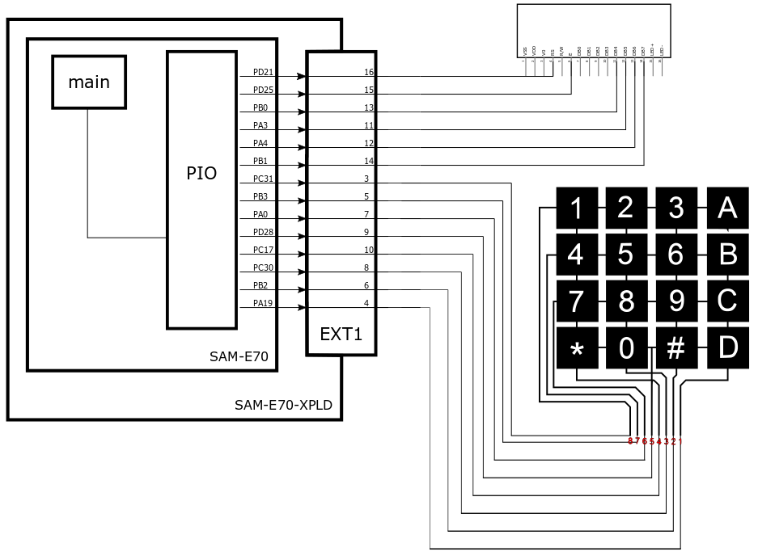

* Teclado Matricial + Display LCD 16x2 (Modo 4 Bits)
* Marco Mello - marcoasma@insper.edu.br
* 20/03/2019

# Resumo :

Esse exemplo demonstra o uso do teclado matricial de 16 teclas (4x4) juntamente com o display de LCD 16x2 em modo 4 Bits

Periféricos uC:

- Power Managment Controller (PMC)
- GPIO -> EXT1
   
Módulos : 

- Teclado Matricial 16 Teclas (4x4)
- Display LCD 16x2 em modo 4 Bits

Pinos específicos :

1) Teclado Matricial (KeyPad) - 16 Teclas 4x4
- D4 -> PB0
- D5 -> PA3
- D6 -> PA4
- D7 -> PB1
- RS -> PD21
- EN -> PD25

2) Display LCD 16x4 Modo 4 Bit
- LIN1 -> PC31
- LIN2 -> PB3
- LIN3 -> PA0
- LIN4 -> PD28
- COL1 -> PC17
- COL2 -> PC30
- COL3 -> PB2
- OL4 -> PA19

## Diagrama

## Funcionamento

O cursor no LCD inicializa na posição (0,0), quando for pressionada uma das teclas do KeyPad, seu respectivo caracter é mostrado no LCD, em seguida a posição do cursor é incrementada e quando um nova tecla for pressionada novamente ela será mostrada na nova posição. Quando ocupada todas as posições do display de LCD, ele limpa a tela e começa novamente a contagem a partir da posição (0,0).

