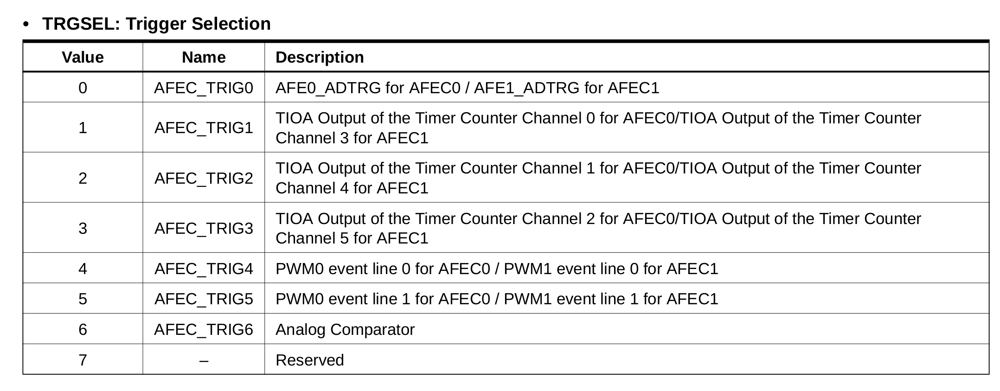

# AFEC - TC0 Trigger

Esse exemplo demonstra como utilizar o Timer para inicializar a conversão analógica digital do AFEC.

Essa técnica diminui o overhead gerado pela interrupção do TC na conversão analógica digital.

- Módulos: 
    - .
    
- Periféricos: 
    - AFEC0 - Analog Front-End Controller
    - TC0 - Timer Counter
    - USART1 (debug - para comunicação com o PC - `stdio` )
    
- Pinos:
    - `stdio` / DEBUG
        - `PB4`:  UART1 
        - `PD21`: UART1
 
- APIs:
    - .

## Conexão e configuração

- Não é necessário

## Explicação

O AFEC possui duas formas de inicializa a conversão analógica-digital, uma por software (escrevendo em um registrador) e a outra é automaticamente pelo timer, como ilustrado no diagrama do manual do uC:


Para ativar esse modo é necessário configurar o ADC e o TC para operarem corretamente.

### ADC Config.

Na função de configuração do ADC (`config_ADC_TEMP(void){}`), é necessário escolher o trigger para ser o TC0

```c
  /* Configura trigger por software */
  afec_set_trigger(AFEC0, AFEC_TRIG_TIO_CH_0);
```

:exclamation: Nem todos os TCs podem ser utilizados para inicializar a convers!ao, verificar tabela no datasheet:



### TC

O TC utilizado deve ser configurado em modo `waveform`, isso é feito na função de configuração do TC: `TC_init()`:

```c
  tc_init(TC, TC_CHANNEL, ul_tcclks
                          | TC_CMR_WAVE /* Waveform mode is enabled */
                          | TC_CMR_ACPA_SET /* RA Compare Effect: set */
                          | TC_CMR_ACPC_CLEAR /* RC Compare Effect: clear */
                          | TC_CMR_CPCTRG /* UP mode with automatic trigger on RC Compare */
	);
```
