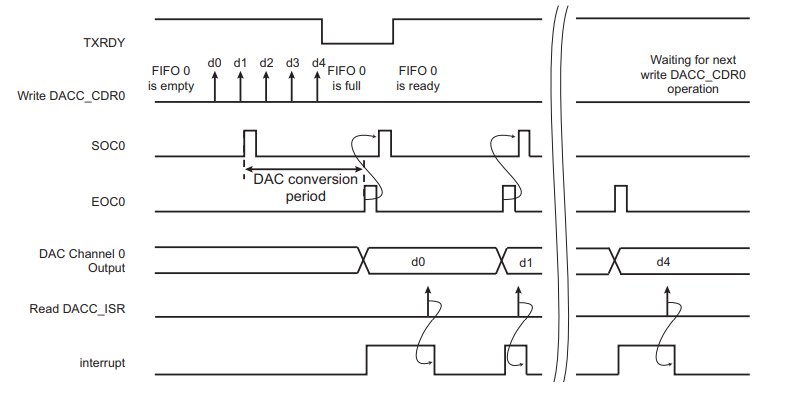

# Digital-to-Analog Converter Controller

## Conexão e configuração

- Conectar o pino PB13 da placa ao osciloscópio.


## Explicação

O Controlador de Conversor Digital para Analógico (DACC) oferece até duas saídas analógicas com uma ponta ou um diferencial analógico, tornando possível a conversão digital para analógico para acionar até duas  analógicas independentes.

Ele suporta resolução de 12 bits e opera em modo Free-running, modo Max speed, modo Trigger ou modo Interpolation.

Além disso, integra um modo Bypass que minimiza o consumo de energia no caso de uma taxa de amostragem de conversão limitada.


Esta aplicação tem como objetivo demonstrar como utilizar o DACC no modo de funcionamento livre.
O exemplo permite configurar a frequência e a amplitude da onda senoidal de saída. A frequência poderia ser definida de 200Hz a 3KHz, e a amplitude de pico poderia ser definida de 100 a 1023/4095 em relação à resolução de 10/12bit.

O exemplo também pode gerar uma onda quadrada de amplitude total para referência.

Abaixo está o diagrama do DACC:


A saída poderia ser monitorada conectando o pino usado a um canal do osciloscópio.

### Main

A função `main` desse programa é responsável por gerar um menu que pode ser controlado via UART para definição dos valores de frequência e amplitude e, com isso, a criação de um sinal analógico que pode ser monitorado conectando o pino DACC ao osciloscópio.

``` c
/************************************************************************/
/* Main Code	                                                        */
/************************************************************************/
int main(void)
{
	uint8_t uc_key;
	uint32_t ul_freq, ul_amp;

	/* Initialize the system */
	sysclk_init();
	board_init();

	/* Initialize debug console */
	configure_console();

	start_dacc();

	/* Output example information */
	puts(STRING_HEADER);

	g_l_amplitude = MAX_AMPLITUDE / 2;
	g_ul_frequency = DEFAULT_FREQUENCY;

	SysTick_Config(sysclk_get_cpu_hz() / (g_ul_frequency * SAMPLES));

	/* Main menu */
	display_menu();

	while (1)
	{
		usart_serial_getchar((Usart *)CONSOLE_UART, &uc_key);

		switch (uc_key)
		{
		case '0':
			printf("Frequency:\t");
			ul_freq = get_input_value(MIN_FREQUENCY, MAX_FREQUENCY);
			printf("\r\n");

			if (ul_freq != VAL_INVALID)
			{
				printf("Set frequency to : %luHz\n\r", (unsigned long)ul_freq);
				SysTick_Config(sysclk_get_cpu_hz() / (ul_freq * SAMPLES));
				g_ul_frequency = ul_freq;
			}
			break;

		case '1':
			printf("Amplitude:\t");
			ul_amp = get_input_value(MIN_AMPLITUDE, MAX_AMPLITUDE);
			printf("\r\n");
			if (ul_amp != VAL_INVALID)
			{
				printf("Set amplitude to : %lu\n\r", (unsigned long)ul_amp);
				g_l_amplitude = ul_amp;
			}
			break;

		case 'i':
		case 'I':
			printf("-I- Frequency : %lu Hz Amplitude : %ld\n\r",
				   (unsigned long)g_ul_frequency, (long)g_l_amplitude);
			break;

		case 'w':
		case 'W':
			printf("-I- Switch wave to : %s\n\r", g_uc_wave_sel ? "SINE" : "Full Amplitude SQUARE");
			g_uc_wave_sel = (g_uc_wave_sel + 1) & 1;
			break;

		case 'm':
		case 'M':
			display_menu();
			break;
		}
		puts("Press \'m\' or \'M\' to display the main menu again!\r");
	}
}

```

- `get_input_value`: Pega os valores de máximo e de mínimo da amplitude.
- `dacc_enable`: Habilita o DACC.

#### get input value

A função `get_input_value` tem como objetivo pegar os valores de amplitude ou frequência inputados pelo usuário e validá-los com os valores mínimos e máximos permitidos. Além disso, a função limita os valores a terem 4 dígitos.

```C
/**
 * Get input from user, and the biggest 4-digit decimal number is allowed.
 *
 * ul_lower_limit -> The lower limit of input
 * ul_upper_limit -> The upper limit of input
 */

static uint32_t get_input_value(uint32_t ul_lower_limit, uint32_t ul_upper_limit)
{
	uint32_t i = 0, length = 0, value = 0;
	uint8_t uc_key, str_temp[5] = {0};

	while (1)
	{
		usart_serial_getchar((Usart *)CONSOLE_UART, &uc_key);

		if (uc_key == '\n' || uc_key == '\r')
		{
			puts("\r");
			break;
		}

		if ('0' <= uc_key && '9' >= uc_key)
		{
			printf("%c", uc_key);
			str_temp[i++] = uc_key;

			if (i >= 4)
			{
				break;
			}
		}
	}

	str_temp[i] = '\0';
	/* Input string length */
	length = i;
	value = 0;

	/* Convert string to integer */
	for (i = 0; i < 4; i++)
	{
		if (str_temp[i] != '0')
		{
			switch (length - i - 1)
			{
			case 0:
				value += (str_temp[i] - '0');
				break;

			case 1:
				value += (str_temp[i] - '0') * 10;
				break;

			case 2:
				value += (str_temp[i] - '0') * 100;
				break;

			case 3:
				value += (str_temp[i] - '0') * 1000;
				break;
			}
		}
	}

	if (value > ul_upper_limit || value < ul_lower_limit)
	{
		puts("\n\r-F- Input value is invalid!");
		return VAL_INVALID;
	}

	return value;
}
```

### DACC

O DACC conta com três canais (canal 0, canal 1 e canal de Trigger), cada um com um respectivo pino. No caso desse exemplo, foi usado o canal 0 (pino PB13).

A conversão começa assim que pelo menos um canal é habilitado. Uma vez que os dados são escritos na Conversão de Registro de Dados do DACC (DACC_CDRx), 12 períodos de relógio DAC depois, os dados convertidos estão disponíveis na saída analógica correspondente. Os dados seguintes são convertidos somente quando o EOC dos dados anteriores é definido.
Se o FIFO for esvaziado, nenhuma conversão ocorre e os dados são mantidos na saída do DAC.

