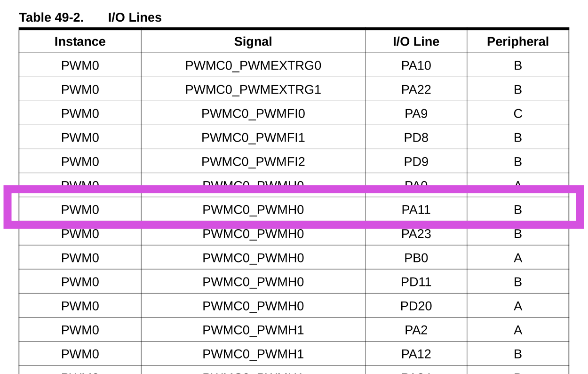

# PWM - LED 

Esse exemplo configura o pino PA0 para ser controlado pelo PWM0, canal 0. Realizando um controle da intensidade luminosa do LED via duty cycle do PWM.

- Módulos: 
    - OLED
    
- Periféricos:
    - PWM0 - Pulse Width Modulation
    - USART1 (debug - para comunicação com o PC - `stdio` )
    
- Pinos:
    - `PIOA`: LED do OLED
    - `PA11`: Botão
    - `stdio` / DEBUG
        - `PB4`:  UART1 
        - `PD21`: UART1
 
- APIs:
    - .

## Conexão e configuração

- Conectar o OLED no EXT1

## Explicação

> Ler secção 49 do datasheet para mais informações.

Deve-se primeiramente configurar o pino 0 do PIO A (PA0) para ser controlado pelo periférico PWM:

```c
  /* Configura pino para ser controlado pelo PWM */
  pmc_enable_periph_clk(ID_PIO_PWM_0);
  pio_set_peripheral(PIOA, PIO_PERIPH_A, 1 << 0 );
```



Agora podemos inicializar o PWM 0, canal 0 chamando a função:

```c
  uint duty = 0;
  PWM0_init(duty, 0);
```

Note que toda a complexidade está dentro da função `PWM0_init`, você terá que alterar e entender caso queria adicionar mais um canal de PWM.

Para alterar o duty cycle basta passar o novo valor

```c
  pwm_channel_update_duty(PWM0, &g_pwm_channel_led, duty);
```

Note que utilizamos uma struct global `g_pwm_channel_led` que foi inicializada dentro da função `PWM0_init()`.
