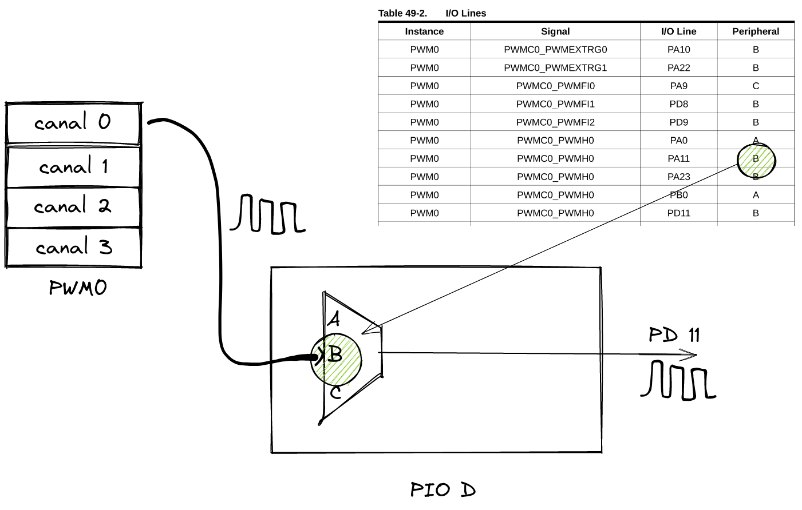
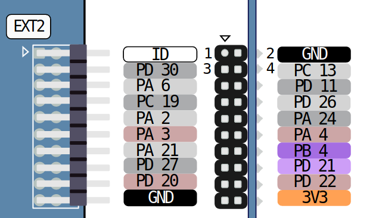

# PWM - LED 

Esse exemplo configura o pino PD11 para ser controlado pelo PWM0, canal 0. Realizando um controle da intensidade luminosa do LED via duty cycle do PWM.

- Periféricos:
    - PWM0 - Pulse Width Modulation
    
- Pinos:
    - `PD11`: PWM
 
## Conexão e configuração

- Conectar um LED no pino PD11 (lembre de colocar um resistor).

## Explicação

> Ler secção 49 do datasheet para mais informações.



Deve-se primeiramente configurar o pino 11 do PIO D (PD11) para ser controlado pelo periférico PWM, note que a tabela indica para configurar o PIO para ser acionado pelo periférico B, isso se traduz no código a seguir:

```c
  /* Configura o pino do PIO para ser controlado pelo PWM */
  /* MUITO IMPORTANTE AJUSTAR ESSE CÓDIGO DE ACORDO COM O CANAL E PINO USADO */
  pmc_enable_periph_clk(ID_PIO_PWM_0);
  pio_set_peripheral(PIO_PWM_0, PIO_PERIPH_B, MASK_PIN_PWM_0);
```


Agora podemos inicializar o PWM0, canal 0 chamando a função:

```c
  /* inicializa PWM com duty cycle 23*/
  /* MUITO IMPORTANTE CRIAR UM pwm_channel_t POR CANAL */
  static pwm_channel_t pwm_channel_pin;
  PWM_init(PWM0, ID_PWM0,  &pwm_channel_pin, PWM_CHANNEL_0, 0);
```

Para alterar o duty cycle basta passar um valor para a função `pwm_channel_update_duty`.

O duty pode ser um valor de **0** até **255**, onde:

- 0: duty 0% (sinal todo o tempo em baixo)
- 255: duty 100% (sinal todo o tempo em alto)

```c
  /* atualiza pwem para 55 */
  pwm_channel_update_duty(PWM0, &pwm_channel_pin, 55);
```

- Note que utilizamos uma struct `pwm_channel_pin` que foi inicializada pela função `PWM0_init()`.

## Usando um pino e um canal diferente

Para configurar um novo pwm, você deve seguir os passos a seguir:

1. Abra o manual na página 1436
1. Escolher um canal
1. Escolher um pino que possa ser controlado pelo canal
1. PIO:
    - Ativar o pio no pmc (`pmc_enable_periph_clk()`)
    - Configurar o pino para ser `acionado` pelo PWM escolhido (`pio_set_peripheral()`)
1. Declarar a struct `static pwm_channel_t` (notem que ela deve ser estática)
1. Inicializar o PWM (`PWM_init()`)
1. Controlar o duty pela função `pwm_channel_update_duty`.

### Exemplo

Vamos configurar por exemplo mais um pino do EXT2 para funcionar como PWM, primeiro vamos ver os pinos disponíveis do canal 1 (que ainda não foi usado):


e os pinos disponíveis no EXT2:



Encontramos o pino **PA24** que pertence ao EXT2 e também ao canal 1 do PWM0, com isso conseguimos preencher a tabela:

| PIO   | Pino | PWM   | Canal | Periférico |
|-------|------|-------|-------|------------|
| PIO A | PA2  | PWM 0 | 1     | A          |

Com as informações podemos fazer o código que inicializa o pino PA24 como sendo controlado pelo PWM:

``` c
pmc_enable_periph_clk(ID_PIOA);
pio_set_peripheral(PIOA, PIO_PERIPH_A, 1 << 2);

static pwm_channel_t pwm_channel_pa2;
PWM_init(PWM0, ID_PWM0,  &pwm_channel_pa2, PWM_CHANNEL_1, 0);
```

E para alterar o pwm, basta:

``` c
int duty = 35;
pwm_channel_update_duty(PWM0, &g_pwm_channel_pa2, duty);
```

Note que da tabela para o código, fizemos as seguintes associações:

| Tabela       | Código          |
|--------------|-----------------|
| PIO A        | `PIOA`          |
| PA2          | `1 << 2`        |
| PWM 0        | `PWM0`          |
| Canal 1      | `PWM_CHANNEL_1` |
| Periférico A | `PIO_PERIPH_A`  |

## Pinos do EXT

A tabela a seguir (criada pelo Marco) possui um mapa de pinos do PWM que podem ser usados no EXT.

| Instance | Channel | I/O Line | Peripheral |
| --- | --- | --- | --- |
| PWM0 | 0 | PA23 | B |
|  |  | PD20 | A |
|  |  | PD11 | B |
| PWM0 | 1 | PA2 | A |
|  |  | PA24 | B |
|  |  | PD21 | A |
| PWM0 | 2 | PD22 | A |
|  |  | PC19 | B |
|  |  | PA13 | B |
| PWM1 | 0 | PA12 | C |
|  |  | PD1 | B |
| PWM1 | 1 | PA14 | C |
|  |  | PD3 | B |
| PWM1 | 2 | PA31 | D |
|  |  | PD5 | B |
