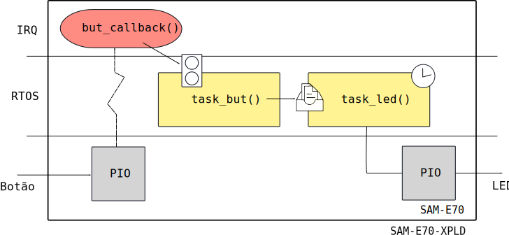

# PIO IRQ - RTOS

Exemplo demonstra duas tarefas, a primeira (`task_but`) lida com um sinal de interrupção vinda de um pino externo (PIO), essa informação é então processada e enviada via uma fila para uma tarefa que controla o piscar do LED (`task_led`), a informação passada na fila é a da frequência na qual o LED deve piscar (utilizando função de delay do próprio RTOS)

- Módulos: 
    - .
    
- Periféricos:
    - USART1 (debug - para comunicação com o PC - `stdio` )
    
- Pinos:
    - `PC8`: LED do kit kit
    - `PA11`: Botão
    - `stdio` / DEBUG
        - `PB4`:  UART1 
        - `PD21`: UART1
 
- APIs:
    - .

## Conexão e configuração

- Não é necessário

## Explicação

