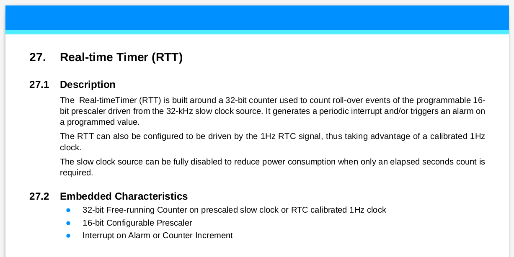

# RTT - Real Timer Timer

O **Real Time Time** (RTT) é um timer similar ao TC, mas bem mais simples. Serve apenas para contar `clocks`. Possui um registrador de 32 bits, ao contrário do TC que o registrador é de 12 bits. O RTT pode ser alimentado por dois clocks distintos. O que permite gerarmos interrupções com grandes períodos de tempo.

## Explicação

O RTT pode gerar interrupção por duas fontes distintas: `Alarme` ou `Mudança no valor do relógio`. O Alarme funciona similar ao alarme do RTC, podemos especificar um valor e quando o contador chegar nesse valor, gera uma interrupção, ou podemos gerar uma interrupção toda vez que o valor do timer mudar (tick). Isso vai depender da frequência na qual ele foi configurado (funcionando similar ao TC).



## RTT_init

A função `RTT_init` configura e ativa o RTT:

```c
static void RTT_init(float freqPrescale, uint32_t IrqNPulses, uint32_t rttIRQSource) {
```

Vamos dar uma olhada nos argumentos

### `freqPrescale`

Define a frequência na qual o RTT irá incrementar o contador. Quanto maior a frequência maior a resolução, porém menor o tempo máximo que conseguimos contar.
    
### `IrqNPulses`

Define o valor do arlarme do RTT, causando uma interrupção quando o contador alcançar tal valor. 

> Necessita ativar interrupção.

### rttIRQSource

Define qual tipo de interrupção será ativada:

- `RTT_MR_RTTINCIEN`: Interrupção por incremento (pllPreScale)
- `RTT_MR_ALMIEN` : Interrupção por alarme (irqRTTvalue)

Note que você pode ativar as duas interrupções simultâneamente: `RTT_MR_RTTINCIEN | RTT_MR_ALMIEN`.

Caso não queria ativar interrupção no RTT (e usar ele apenas como contador), basta passar o valor 0 nesse
argumento.

### RTT_Handler

Função chamada pelo NVIC quando acontecer alguma interrupção do RTT. Notem que 
no exemplo verificamos por qual motivo o RTT_Handler foi chamado: `RTT_SR_RTTINC` ou `RTT_SR_ALMS`

```c
void RTT_Handler(void) {
  uint32_t ul_status;

  /* Get RTT status - ACK */
  ul_status = rtt_get_status(RTT);

  /* IRQ due to Time has changed */
  if ((ul_status & RTT_SR_RTTINC) == RTT_SR_RTTINC) {
     pin_toggle(LED_PIO, LED_IDX_MASK);    // BLINK Led
   }

  /* IRQ due to Alarm */
  if ((ul_status & RTT_SR_ALMS) == RTT_SR_ALMS) {
      f_rtt_alarme = true;                  // flag RTT alarme
   }  
}
````

### main

1. O código começa configurando o RTT para operar com alarme: 
    - incremento a cada 0.25s (4Hz)
    - Alarme em 16 incrementos que é equivalente a 4s (0.25s * 16 = 4s)  
    - IRQ: Alarme 
```c
    RTT_init(4, 16, RTT_MR_ALMIEN);
```

2. Passado os 4s, o RTT_Handler é chamado por conta do Alarme, então o RTC é configurado para operar com IRQ de incremento.

```c
  /* IRQ due to Alarm */
  if ((ul_status & RTT_SR_ALMS) == RTT_SR_ALMS) {
      RTT_init(4, 0, RTT_MR_RTTINCIEN);         
  }  
```

3. Agora a cada 0.25s o RTT_Handler é chamado por conta do IRQ de incremento e o estado do pino do LED invertido, fazendo o LED piscar:

```c
  /* IRQ due to Time has changed */
  if ((ul_status & RTT_SR_RTTINC) == RTT_SR_RTTINC) {
     pin_toggle(LED_PIO, LED_IDX_MASK);    // BLINK Led
   }
```

Notem que o nosso super loop está vazio e mesmo assim o LED pisca!!!

```c
  while (1) {
   
  }  
```
