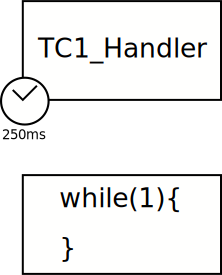
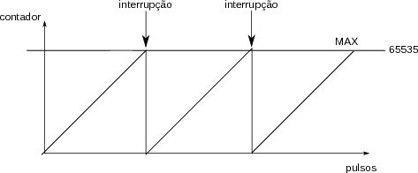
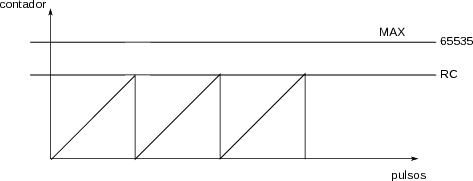
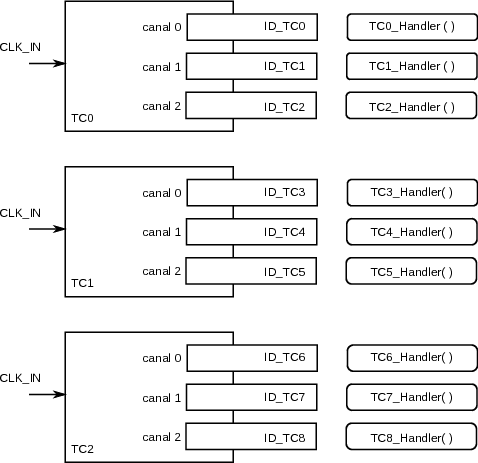

# TC - IRQ

Configura o Timer Counter (TC) para gerar uma interrupção a 4Hz (250 ms).

## Conexão e configuração

- Não é necessário

## Explicação



O exemplo configura o TimerCounter (TC) do microntrolador. O TC0 canal 1 é configurado para gerar uma interrupção (`TC1_Handler`) a cada 250ms (f=1/T -> de 4Hz) fazendo o LED mudar de valor (`pin_toggle`).

### Main

A função `main` desse programa é responsável por inicializar todos os periféricos envolvidos no projeto (PIO para o LED e TC) e então entra em sleep mode no while. 

``` c
/************************************************************************/
/* VAR globais                                                          */
/************************************************************************/
volatile char flag_tc = 0;

/************************************************************************/
/* Main Code	                                                        */
/************************************************************************/
int main(void){
	/* Initialize the SAM system */
	sysclk_init();

	/* Disable the watchdog */
	WDT->WDT_MR = WDT_MR_WDDIS;

	/* Configura Leds */
	LED_init(0);

        /** Configura timer TC0, canal 1 */
	TC_init(TC0, ID_TC1, 1, 4);
  	tc_start(TC, TC_CHANNEL);
	
	while (1) {
            pmc_sleep(SAM_PM_SMODE_SLEEP_WFI);
	}
}
```

- `TC_init`: Inicializa TC, **mas não inicializa contagem**
- `tc_start` Faz com que o TC inicialize a contagem, as interrupções só vão parar quando você chamar a função `tc_stop`.

#### Interrupção

Sempre que houver um reset no contador do TC a interrupção referente ao canal é chamada, nessa interrupção fazemos a leitura do status do TC (para avisar o periférico que a interrupção foi resolvida) e então fazemos a inversão do valor que controla o led (`pin_toggle`).

```C
/**
*  Interrupt handler for TC1 interrupt.
*/
void TC1_Handler(void) {
	/**
	* Devemos indicar ao TC que a interrupção foi satisfeita.
	* Isso é realizado pela leitura do status do periférico
	**/
	volatile uint32_t status = tc_get_status(TC0, 1);

	/** Muda o estado do LED (pisca) **/
	pin_toggle(LED_PIO, LED_IDX_MASK);  
}
```

Note que ao chamarmos a função `tc_get_status(TC0, 1)` estamos automaticamente realizando o **ACK** da interrupção.

### Timer Counter - TC

O TC é um periférico de contagem de pulsos, esses pulsos podem ser provenientes do mundo externo (abrir e fechar de portas, encoder de um motor, pulsos de um PWM) ou interno ao próprio microcontrolador, utilizando o clock como sinal de entrada.
Esse contador é formado por 16 bits, limitando o valor máximo que pode contar em : 2^16 -1 = 65535.


No modo de contagem de clocks, o TC operar como um cronometro utilizando o clock do microcontrolador como sua base de tempo, ou seja, a cada pulso de clock o valor do contador é incrementado de um. 

Se usarmos o clock base do sistema (300 Mhz) na entrada do TC, ou seja, 300 milhões de pulsos em um segundo, poderíamos contar até
no máximo 218us (x = 65535/300M). Para possibilitar uma maior flexibilidade ao TC, podemos optar por divir o clock de entrada (300Mhz)
em alguns prescales : 1/1, 1/8, 1/32, 1/128. Possibilitando que o TC conte por períodos mais longos.

A cada vez que o contador é reiniciado (quando atinge o seu valor máximo) uma interrupção (TCx_Handler) é gerada:



Cada canal possui um registrador chamado de RC que possibilita o reset do contador em um valor diferente que o máximo. Esse registrador
é utilizado para gerar a frequência desejada.



Cada TC possui três canais (canal 0, canal 1, canal 2), podendo cada canal operar de maneira independente, porém com a mesma
configuração de prescale, conforme ilustração a seguir :



A função a seguir configura o TC para operar com uma frequência **freq**:

```C
/**
* Configura TimerCounter (TC) para gerar uma interrupcao no canal (ID_TC e TC_CHANNEL)
* na taxa de especificada em freq.
*/
void TC_init(Tc * TC, int ID_TC, int TC_CHANNEL, int freq){
	uint32_t ul_div;
	uint32_t ul_tcclks;
	uint32_t ul_sysclk = sysclk_get_cpu_hz();

	uint32_t channel = 1;

	/* Configura o PMC */
	/* O TimerCounter é meio confuso
	o uC possui 3 TCs, cada TC possui 3 canais
	TC0 : ID_TC0, ID_TC1, ID_TC2
	TC1 : ID_TC3, ID_TC4, ID_TC5
	TC2 : ID_TC6, ID_TC7, ID_TC8
	*/
	pmc_enable_periph_clk(ID_TC);

	/** Configura o TC para operar em  freq hz e interrupçcão no RC compare */
	tc_find_mck_divisor(freq, ul_sysclk, &ul_div, &ul_tcclks, ul_sysclk);
	tc_init(TC, TC_CHANNEL, ul_tcclks | TC_CMR_CPCTRG);
	tc_write_rc(TC, TC_CHANNEL, (ul_sysclk / ul_div) / freq);

	/* Configura e ativa interrupçcão no TC canal 0 */
	/* Interrupção no C */
	NVIC_EnableIRQ((IRQn_Type) ID_TC);
	tc_enable_interrupt(TC, TC_CHANNEL, TC_IER_CPCS);
}
```
