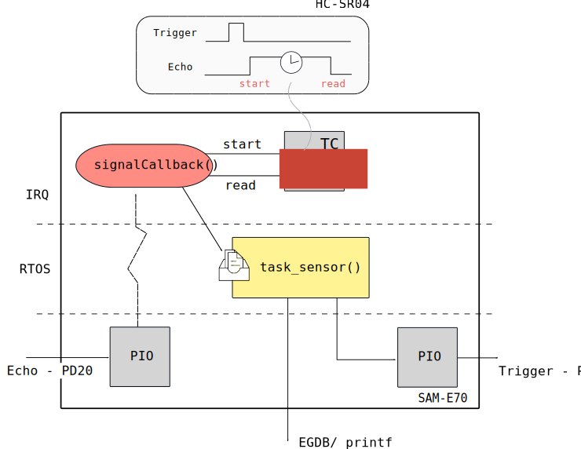

# PIO IRQ - RTOS

Exemplo demonstra duas tarefas, a primeira (`task_but`) lida com um sinal de interrupção vinda de um pino externo (PIO), essa informação é então processada e enviada via uma fila para uma tarefa que controla o piscar do LED (`task_led`), a informação passada na fila é a da frequência na qual o LED deve piscar (utilizando função de delay do próprio RTOS)

- Módulos: 
    - .
    
- Periféricos:
    - TC0, channel 1: Timer para contagem do tempo
    - USART1 (debug - para comunicação com o PC - `stdio` )
    
- Pinos:
    - `PC8`: Trigger
    - `PD20`: Echo
    - `stdio` / DEBUG
        - `PB4`:  UART1 
        - `PD21`: UART1

- APIs:
    - freeRTOS

## Documentação

- HC-SR04: https://cdn.sparkfun.com/datasheets/Sensors/Proximity/HCSR04.pdf 

## Conexão e configuração

- Seguir diagrama de montagem do cheatsheet

## Explicação

