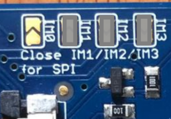

# 2.8-TFT-LCD-ILI9341-Adafruit montagem

Página que descreve como realizar a montagem do display 2.8 TFT LCD da Adafruit
no kit de desenvolvimento SAME70-XPLD.

- LCD: https://www.adafruit.com/product/1770

## Sobre o LCD

O LCD da adafruit possui como controlador o ILI9341 que opera por dois modos: paralelo ou serial SPI, tem resolução de **240x320** pixels rgb. 

Nós soldamos os jumpers `IM3`, `IM2`, `IM1` escolhendo a comunicação SPI como forma de comunicação entre o microcontrolador e o ILI9341:

O LCD possui uma tela resistiva que fornece a posição e intensidade do toque por meio de dois sinais analógicos (x+, x- e y+ e y-).

## Conectando LCD

Para conectar a parte de controle do display ao kit, faça as conexões listadas a seguir, note que usamos apenas pinos do EXT2:

| LCD  | EXT2  | SAME70 |
| ---- | ----- | ------ |
| GND  | 19    | GND    |
| VIN  | 20    | 3V3    |
| CLK  | 18    | PD22   |
| MISO | 17    | PD20   |
| MOSI | 16    | PD21   |
| CS   | 15    | PD27   |
| D/C  | 5     | PA6    |
| y+   | 3     | PD30   |
| x+   | 7     | PC19   |
| y-   | 6     | PD11   |
| x-   | 4     | PC13   |

Vocês podem ou não usar uma protoboard para a montagem, abaixo foram utilizados apenas jumpers F-F:

## Pinos

Os pinos tem o uso a seguir:

- gnd: Terra
- 3-5v: Conectado no 5V do kit
- CLK: Clock do SPI
- MISO: Dado OUT do SPI
- MOSI: Dado In do SPI
- CS: Chip Select do SPI
- D/C: Para indicar se é um dado ou comando SPI 

## Conexões com o adaptador TFT LCD - Xplained V0

