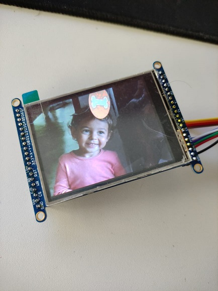

2.8-TFT-LCD-ILI9341-image

Demo de como exibir uma imagem estática no LCD sem usar nenhuma biblioteca gráfica.

Antes de seguir você deve ter montando o hadware como explicado em:

    https://github.com/Insper/SAME70-examples/tree/master/Screens/2.8-TFT-LCD-ILI9341-Hardware

O resultado obtido deve ser:

