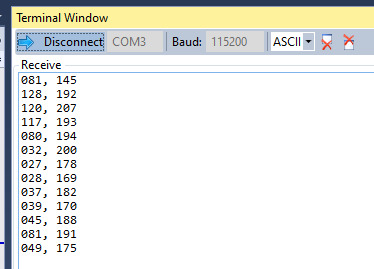

# 2.8-TFT-LCD-ILI9341-touch

Demo da leitura do touch resistivo do LCD 2.8 TFT da Adafruit.

Antes de seguir você deve ter montando o hadware como explicado em: 

- https://github.com/Insper/SAME70-examples/tree/master/Screens/2.8-TFT-LCD-ILI9341-Hardware

## testando

Para validar embarque o código, abra o terminal e encoste na tela, o programa deve exibir no terminal o valor X e Y lido. Você pode alterar a sensibilidade do toque no arquivo `config/touch.h` no `#define TOUCH_PRESSURE_DETECT`, quanto maior o valor menor a sensibilidade.

O resultado obtido deve ser:

