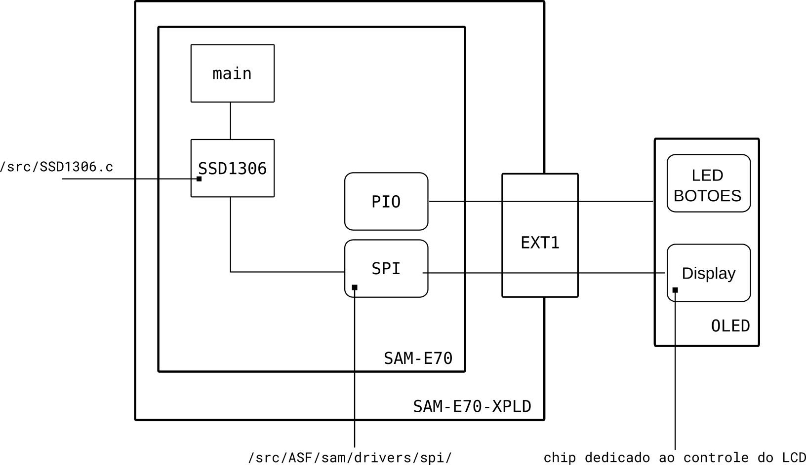
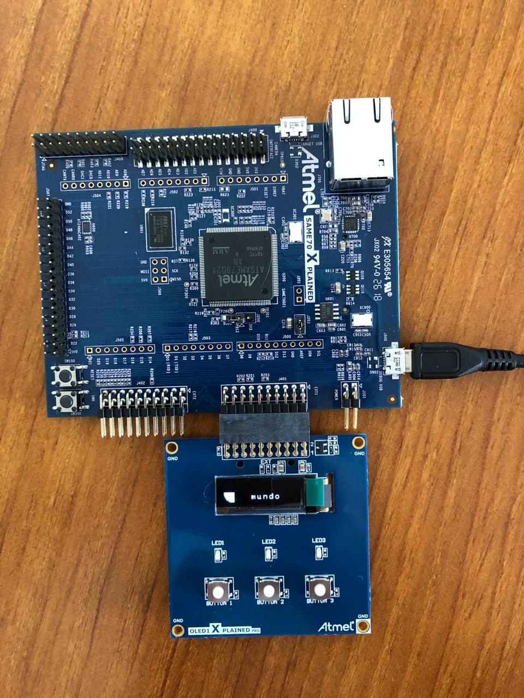

# Resumo :

Esse exemplo demonstra o controle do módulo de `OLED 1 XPLAINED PRO`  via interface SPI (Serial Peripheral Interface Bus).

Periféricos uC:

    - Power Managment Controller (PMC)
    - Serial Protocol Interface (SPI)
 
APIs :

    - Driver SSD1306
 
Módulos : 

    - OLED 1 XPLAINED PRO

## Diagrama

## Resultado

