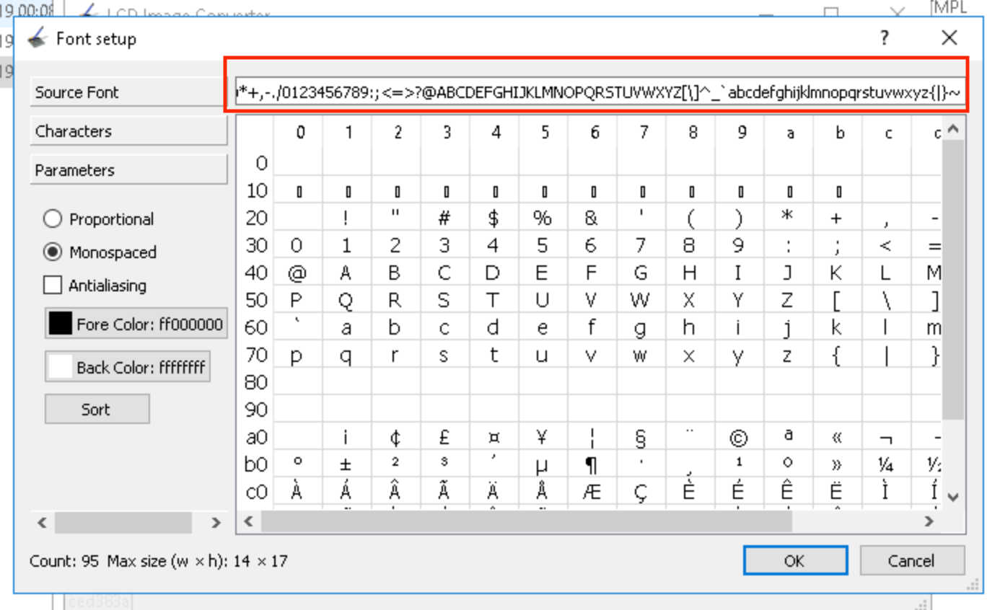

# LCD-Fonts

Este exemplo utiliza 3 tipos de fontes diferentes para criação de textos na tela LCD do kit `Atmel SAME70 Xplained`.

As fontes inclusas são:

- Source Code Pro, tamanho 28
- Calibri, tamanho 36
- Arial, tamanho 72

O uso de cada fonte pode ser feito utilizando a função:

```c
font_draw_text(Font *font, const char* texto, int x, int y, int spacing)
```

Parametrôs:

1. `*font`: ponteiro para o struct de cada fonte
1. `texto`: texto a ser desenhado na tela usando a fonte
1. `x, y` : coordenadas para o desenho do texto no LCD`
1. `spacing`: espaçamento horizontal em pixels entre cada letra da fonte`

Observe no entanto, que nem todas fontes inclusas possuem todos caracteres ASCII printáveis.

| Fonte | Caracteres dispóniveis | 
| ----- | ---------------------- |
| source code pro | Apenas de A a Z (maísculo) |
| calibri | Todos ASCII printáveis |
| arial | Apenas de 0 a 9 (números) |

Um dos motivos para a restrição de caracteres disponíveis é para reduzir o consumo de memória.

## Detalhes

Neste exemplo, as fontes na realidade são fontes `Bitmap`, que não passam de uma imagem de cada caractere já renderizado num tamanho, cor e fundo especificados previamente. 

Você pode observar cada letra armazenada como imagens na pasta `font/` :

- `calibri_36.h`
- `sourcecodepro_28.h` 
- `arial_72.h`

Note que incluímos no `main.c` esses arquivos 

```c
#include "fonts/tfont.h"
#include "fonts/sourcecodepro_28.h"
#include "fonts/calibri_36.h"
#include "fonts/arial_72.h"
```

## Criando sua própria fonte

- Para a criação de fontes vamos utilizar o aplicativo gratuito [lcd-image-converter](https://www.riuson.com/lcd-image-converter).


- Abra o aplicativo e selecione para criar uma nova fonte. Indique um nome apropriado de fonte. Sugestão: `nome_da_fonte_TAMANHO`.


- Irá abrir a janela de configuração da fonte, escolha a cor de fundo e a cor da fonte. Em seguida, clique em `Source Font` na lateral e escolha a fonte desejada e o tamanho.


- Note que na parte superior, existe uma barra com diversos caracteres, este são os caracteres que estão sendo gerados, por padrão, já está todo o ASCII printável (do caractére 32 que representa o espaço até o caractére 126 que representa o ~). 



- Você pode alterar os caracteres que são gerados, no entanto, é preciso manter a ordem ASCII para funcionar com a biblioteca do exemplo, por exemplo, se deseja apenas números, deverá pegar toda a faixa de 0-9 do ASCII na ordem do ASCII (0123456789). Não é possível gerar com a ordem por exemplo (987213456) ou ainda pular caracteres em específico (isto vale para textos também).
Em dúvidas consulte a tabela ASCII.


- Clique em OK, e o aplicativo permitirá voce editar cada letra manualmente se desejado (no entanto não iremos fazer). Vamos utilizar a opção `Font->Optimize Height` e clique em OK na janela que abrir. Esta opção irá remover espaços em branco em excesso (auxilia na redução de memória utilizada pela fonte)


- Em seguida clique em `Options` e verifique se o `Preset` está em [`Color R8G8B8`](https://github.com/Insper/SAME70-examples/blob/master/Screens/RTOS-LCD-maxTouch-Images/Color%20R8G8B8.xml) (modo suportado pela biblioteca do LCD). Clique na aba `Image` e verifique se o prefix está como `0x`, o suffix em branco e o delimiter com `,` e clique em OK.


- Agora, basta salvar a nossa nova fonte, vá em `File->Convert...` e entra na pasta do projeto, na pasta `src` onde está o arquivo `main.c`. Coloque o nome do arquivo como colocou na fonte `nome_da_fonte_TAMANHO.h` e certifique-se que o tipo está como `C header file (.h)`.


- Com o projeto aberto no *Atmel Studio*, no *Solution Explorer* (onde pode se ver os arquivos do projeto), clique em `src` com o botão direito e `Add->Existing Item..` e escolha o arquivo da fonte gerado.


- Abra o arquivo da fonte no *Atmel Studio*, procura pela primeira linha, onde temos ```#include <stdint.h>``` e inclua em baixo `#include "tfont.h"`. O arquivo `tfont.h` possui definições das padrões de fontes para podermos utilizar em nosso código.


- Neste mesmo arquivo, procure a última linha, onde deverá ter algo similar a ```const tFont nome_da_sua_fonte_TAM = { TAM, nome_da_sua_fonte_TAM_array };```
Após o último paramêtro, coloque mais dois parametros, no caso, o caractere inicial da sua fonte e o caractere final, conforme quando criamos a fonte.
Se a sua fonte for ASCII printável completo, deverá ser ' ' e '~'. Se for apenas números seria '0' e '9'.
Exemplos: 

```c
const tFont sourcecodepro_28 = { 26, sourcecodepro_28_array, 'A', 'Z' };
const tFont calibri_36 = { 95, calibri_36_array, ' ', '~' };
```


- Agora no arquivo principal `main.c`, devemos incluir as fontes que desejamos utilizar.
Exemplos:

```c
#include "fonts/sourcecodepro_28.h"
#include "fonts/calibri_36.h"
#include "fonts/arial_72.h"
```

- Agora basta utilizar a função `font_draw_text(Font *font, const char* texto, int x, int y, int spacing)` indicando a nova fonte.
