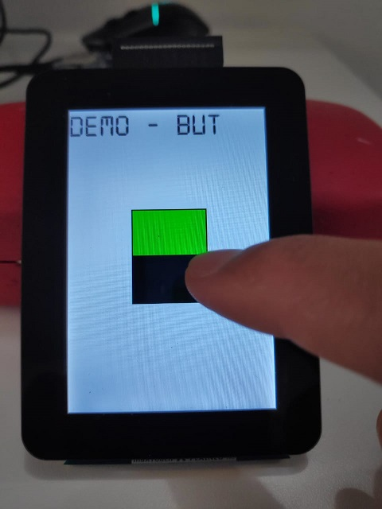
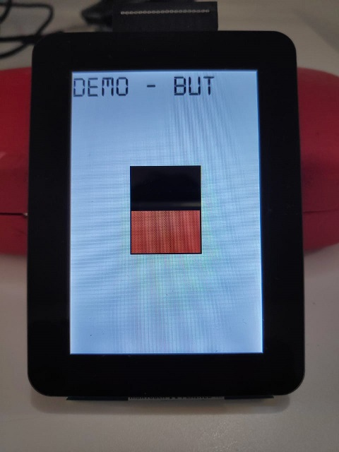
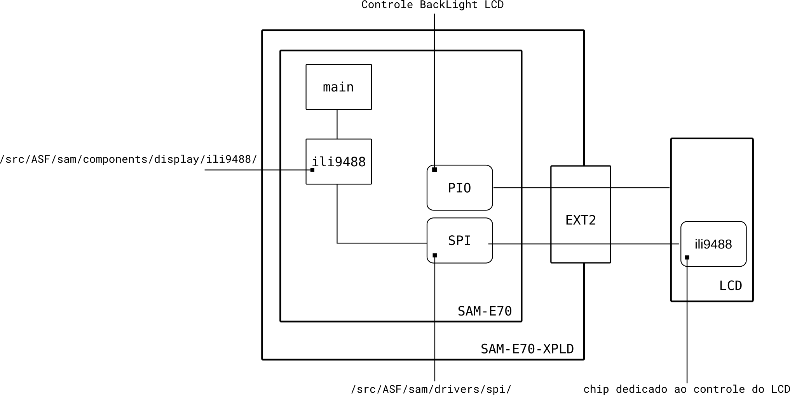

- Computação Embarcada - Insper
- Marco Mello
- 22/04/2020

Esse exemplo demonstra a interface de Touch Screen + Tela LCD utilizando o módulo LCD maXTouch Xplained.

Periféricos uC:

  - Power Managment Controller (PMC)
  - USART
  - Serial Protocol Interface (SPI)

APIs :

  - Driver ili9488

Módulos : 

  - LCD maXTouch Xplained Pro

## Como funciona esse exemplo?

Ao iniciar o programa, no LCD é desenhado um botão, o seu estado inicial é LIGADO (Verde):

Ao clicar no botão, o mesmo troca o seu estado para DESLIGADO (Vermelho):

## Diagrama

## USART

- BaudRate : 115200
- StopBit  : 1 bit
- Paridade : 0 bit
- Data     : 8 bits

Utilizado como debug do programa, deve-se utilizar um terminal (exe. putty) no computador para acessar o printf realizado no firmware, ou o própio Terminal Windows do Atmel Studio.

## SPI

- BaudRate : 20000000
- 8 bits

O Serial Peripheral Interface Bus (SPI) é uma maneira serial de dois dispositivos (ou chips) se comunicarem, o SPI é amplamente
utilizado pela industria e diversos sensores e atuadores o utilizam com forma de comunicação. 

O SPI possui as seguintes configurações :

 - Síncrono 
 - Barramento diferenciado de dados de entrada/saída
 - Serial

Para mais informações acesse o site da sparkfun : [SPI SparkFun](https://learn.sparkfun.com/tutorials/serial-peripheral-interface-spi)

O SPI é utilizado pela API ili9488 para acessar e configurar o LCD.

