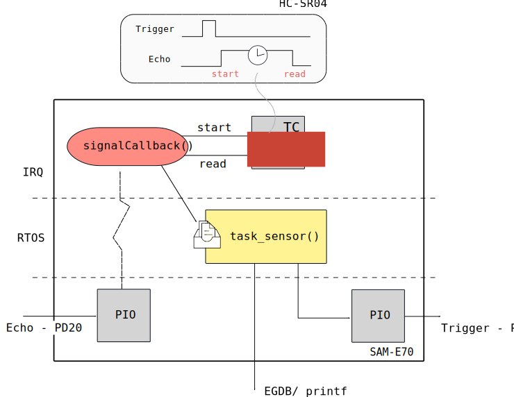

# HC-SR04 - RTOS

Esse exemplo mostra como ler corretamente o sensor de distância HC-SR04 com o uso do RTOS. O firmware
foi implementando da seguinte maneira: A tarefa `task_sensor` é responsável por gerar o pulso de 10 us no pino de `Trigger` do sensor e então aguarda pela informação do tempo via uma fila (`xQueue1`). Uma interrupção é configurada no pino do `Echo`, essa IRQ funciona tanto para borda de subida, quando descida. Dentro da interrupção, verifica-se por qual motivo entrou: se borda de subida, inicializa a contagem do tempo pelo periférico TC, se borda de descida, busca a informação de quanto tempo o `Echo` levou e então envia para a task `task_sensor` via a fila `xQueue1`.

- Módulos: 
    - [HC-SR04](https://cdn.sparkfun.com/datasheets/Sensors/Proximity/HCSR04.pdf)
    
- Periféricos:
    - TC0, channel 1: Timer para contagem do tempo
    - USART1 (debug - para comunicação com o PC - `stdio` )
    
- Pinos:
    - `PC8`: Trigger
    - `PD20`: Echo
    - `stdio` / DEBUG
        - `PB4`:  UART1 
        - `PD21`: UART1

- APIs:
    - freeRTOS

## Documentação

- HC-SR04: https://cdn.sparkfun.com/datasheets/Sensors/Proximity/HCSR04.pdf 

## Conexão e configuração

- Seguir diagrama de montagem do cheatsheet

## Explicação

